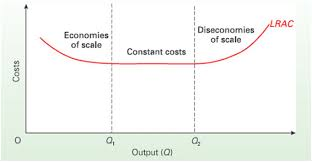
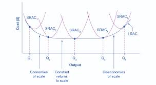
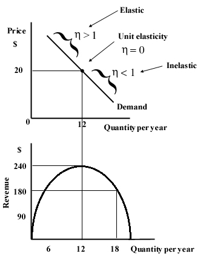

# Revenue, costs and profits

when marginal > average, average increases.

$m > a, a -  increases$

**Short run** is where at least one factor of production is fixed.

**long run** is when <u>all</u> factors of production can be varied at once

**marginal** is the last contribution to the <u>total</u>

1) Total product will rise, when marginal product is positive, <u>not falling</u>


**The law of diminishing returns**  is when a variable factor, eg labour, is added to a fixed factor, eg capital, the marginal product and <u>eventually</u> the average product will fall. *therefore* the marginal cost and <u>eventually</u> the average cost will rise.

<font size=5>

$Average \space returns = \frac{total \space product}  {variable \space factor}$

</font>

**Returns to scale** is a long run equivilent of diminishing marginal reutrns

**Increasing returns to scale** is $\%change \space inputs < \%change \space in \space outputs$ 

**Decreasing returns to scale** is $\% \space change \space in \space inputs > \% \space change \space in \space output$ 
- can happen due to bad communications between global firms

**Constant returns to scale**  is when you have minimised long run costs.

Returns of scale <u>causes</u> dis/economies of scale. They are not the same.



Types of economies of scale:
- managerial (good managers)
- technical (efficient machines)
- risk-bearing (exploring new markets)
- marketing (one advert advertises more shops)
- financial (banks trust you more, to big to fail)
- productive (more produced, reduces the effect of fixed cost)
- purchasing (buying in bulk)

## Long run production theory

firms can increase output in short run by adding more of the variable factor of production



The long run average cost curve (LRAC) is made up of many instances of the short run average cost curve (SRAC)

- The SRAC crurve show diminishing returns in the short run
- The LRAC curve shows economies/diseconomies of scale in the long run

Popular essay question is how can you achieve diminishing returns in the SR but economies of scale in the LR
- cuts the upward sloping part of the SR curve, but continues to go down the LR curbe

## Costs

**Comodities** is the technical name for raw materials


**stepped fixed cost** is when fixed cost increases vertically because the fixed capital cannot accomidate the increasing variable, so new infrastructure/captial must be put in place to produce more

```
Total cost = Fixed cost + Variable cost

Average cost = total cost / Quantity

Marginal cost = Change in total cost / Change in quantity
```

**Marginal cost** is the extra cost endured when an aditional unit of a variable factor of production is added

## Revenue

**average cost** is the cost per unit 

**Revenue maximisation** is when $MR=0$

Reasons to revenue maximise:
1) economies of scale
2) allows for predatory pricing
3) Principle agent problem (good for managers as they get bigger bonuses)

**marginal physical product** is the change in output resulting from employing one more uit of a variable input.

```
Average revenue = Total revenue / quantity

Margianl revenue = Change in total revenue / change in quantity
```

You maximise total revenue when you have unitary estaticisity of demand




the Marginal revenue curve is twice as sleep as the Average revenue

## Profit

Total cost includes opportunity cost

**Profit satisficing** is when profit is sacrifice in order to satisft as many stakeholders as possible

**Opportunity cost** is the required rate of return that keeps a firm in the market.

**Normal profit** is the minimum profit required to keep surviving

Profit acts as two things:
- an incentive
- a signal

**Super normal profit** is any profit earned above normal profit

For normal profit `TR=TC` and `AR=AC`

**non-axiamatic** means the curve will never go below zero, eg demand

**non-satiety** mean you can never have enough of something.

```
SNP (AR>AC)
NP (AR+AC)
SubNP (AR < AC)
```