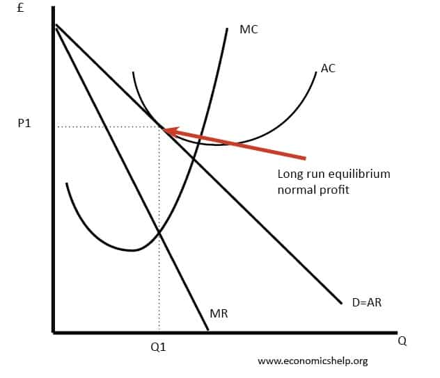
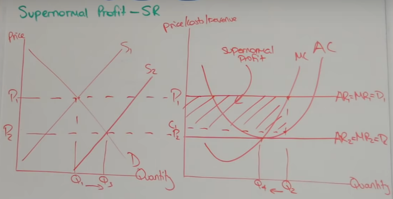
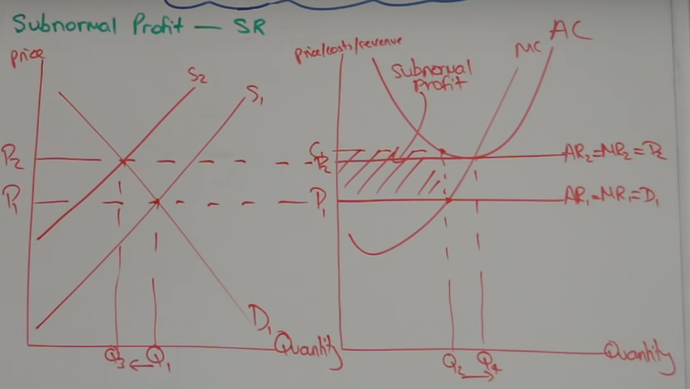

## monopoly diagram

1) Draw the D=AR curve
2) Draw the MR curve (which is twice as steep)
3) Draw the MC cruve
4) Mark the profit max level of output (MR=MC)
5) Determine profit max price
6) Then draw AC cure to determine:
- super normal profit(AR > AC) 
- normal profit (AR = AC)
- subnormal profit (AR < AC)

---

## 3 objectives of the firm

1) Profit maximising (MR=MC) at Q1
2) Revenue maximise (MR = 0) at Q2
3) Sales maximising (AR=AC) at Q3

**sales maximising** is the most a firm can sell whilst not making a loss

---

## Barries to Entry/Exit

### Legal
1) Patents, new firms cannot use tech or methods
2) Licensces or permits, new firms cannot afford
3) Standards and regulations, high costs to meet these
4) Insurances, high costs

### Technical
1) Start up costs
2) sunk costs (costs that cannot be recovered when a company leaves a market, eg advertising or specialist equipment)
3) Economies of scale, makes it hard for new firms to enter
4) Natural monopolies, makes sense for only one firm

### Strategic
1) Predatory pricing
2) Limit pricing
3) Heavy advertising

### Brand loyalty
1) it exists

### Barriers to exit:
- redundancy costs
- penalties for leaving contracts early
- sunk costs

---

## Competition

**Monopolistic competition** is when there are lots of firms all producing slightly different goods or services

notes for 25 marker on markets:

- monopolies good for producers
> control prices
- monopolies bad for producers
> no competition, so they become compacent
- monopolies bad for consumers
> extortion

> show consumer surplus on a graph
- monopolies good for consumers
> money means research, thus inovation

> means more choice

> as average costs fall, they can pass it on to the consumer, or expand their markets and benefit more consumers by giving them more choice, eg we can import fruit all year round now

---

### Efficientcy

**Productive efficientcy** is when an economy cannot produce any more of one thing without making less of another
, when all resources are being employed efficiently

**Allocative efficientcy** is when the production in an econonmy reflects the producers wants

**Dynamic efficientcy** is producetive efficientcy in the long run

**Static efficientcy** is when an economy is being both productivley and allocativly efficent

**x-inefficiency** is when, due to market conditions, the producer chooses to endure higher average costs, (anything within the AC curve). eg public firms maximising the public's utility

---

### Diagrams

**Super normal profit** in the **Short Run**

- Super normal profit can be made in the short run as the market has not equalibrated.
- As more firms join the market, supply shifts left
- This means AC = AR, therefore normal profit is made in the **LR** 

**Sub normal profit** in the **Short run**

- As more firms leave the market, due to subNP, allowed by no barriers to exit, supply shifts left
- this pushes prices up and in the **LR** means AC = AR and normal profit can be made

---

### Perfect competition

Best example of real perfect competion is a street market, eg fruit stalls

Perfect competition is based of 4 examples:
1) **Many buyers and many sellers**, each firm is to small to affect the price, they are price takers.
2) **Perfect Knowledge**, all information is available to producers and consumers
3) **No barries of entry/exit**, firms can enter and leave markets without restriction
4) **Homogenous output**, all firms produce identical output, there are no brands, consumers are happy to buy the output of any firm

**Hit and run competition** is when a firm joins a market and leaves immedietly as the super normal profits are exhausted.

In a Perfect market it is possible to make Super normal in the **short run** because capital is fixed.

In a perfect market it is *impossible* to make super normal in the **long run** 

---

"Perfectly competitive markets are likely to generate efficiency gains" Explain this statement [12 marks]

- K - productive efficientcy gains due to assumptions
- A - eg fruit selers market take a price a £1 each
- A - super normal profits signal no barrier to entry
- Analysis - no resources wasted

- Eval -  impossible to make SNP
- Eval -  no dynamic efficiencty

- K - PC markets = allocative efficiency
- A - homogoneous product
- A - perfect knoledge
- Analysis - consumer price falls, surplus increases

- Eval - however transport costs
- Eval - charge higher profits for convienient

---

Explain the role of profit in the economy [15 marks]

- K - Signal -> SNP (AR>AC) 
- AExample - SNP earned by samsung, encourage apple to allocate more capital + labour to enter the IoT market.
- A - Do an S/D graph of **contextual** fall of supply as apple enters market
- A2 - Explain what the result the graph shows **and** how this shows role of profit in econ

- Eval - However signal function depends on Barriers to Entry. 
- Eval-  eg brand loyalty reduces the impact of profit as a signal

*always take KA**A** and Ev**al** back to the question*

- K -
- A - 
- A -

---

PC markets are good for consumer because low prices **HOWEVER** there is no reason for firms to innovate or decrease LR costs because of the perfect knoledge assumption, meaning consumers will not expereince long run benefits