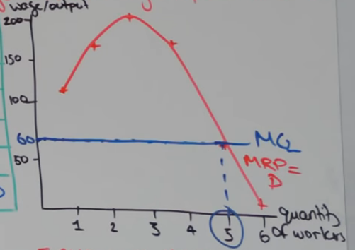
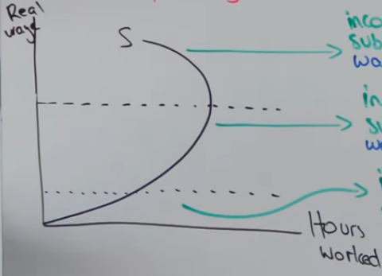
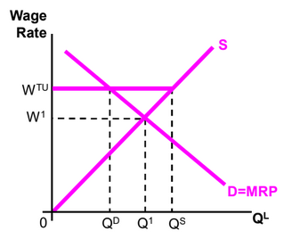
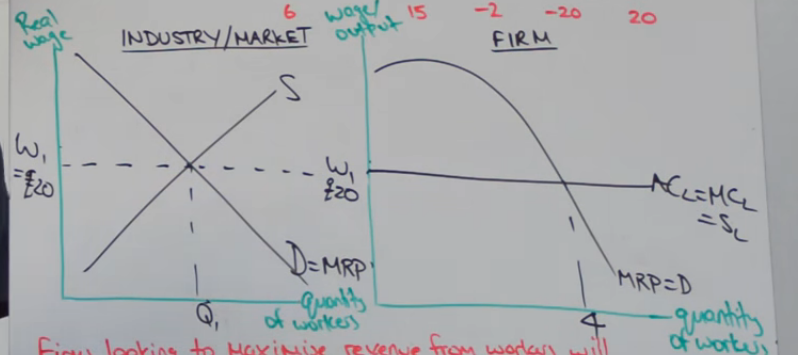
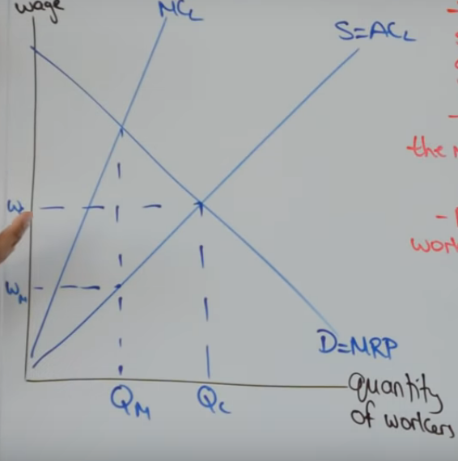
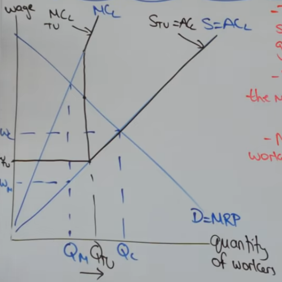

# 3.5 Labour markets

Firms demand labour
households are the suppliers of labour

Higher the wage rate, the less demand for labour

---

### Elasticities 

**Elastic supply** of labour means **lower wages**
- Unskilled labour (more elastic)
- Capacity of labour (more available, more elastic)
- Time (less time it takes to train, more elastic)

**Inelastic supply** of labour means **higher wages**
- skilled labour (eg, doctors, lawyers, football players)

***The more indispencible the labour are, the higher wage rate they can negotiate***

---

### Marginal Revenue product

MRP - **Marginal revenue product** is the extra revenue generated when an additional worker is hired

```
MRP = MPP x MR
Marginal revenue product = Marginal physical product x Marginal revenue
```

MRP = D because the demand of labour is directly related to the product they will make

<u>MRP curve for a firm (in a perfect market)</u>



- MRP is shaped as such due to diminishing returns
- Firms are wage takers not makers, so they must accept the prevailing wage (in this graph 60)
- **Firms will hire workers up untill MRP = W** (in this graph 5)

(The MRP curve for a whole industry is a straight line linear demand curve, it is just simplified. )

The MRP is downward sloping because:
- SR -> law of diminishing returns
- LR -> Substituion of labour and capital (replaced by machines etc)

---

### Criticisms of MRP theory

- Productivity is very difficult to measure, thus MRP is not possible to determine (eg teachers dont produce products thus a price cannot be associated)
- Teamwork makes it difficult to measure individual productivty, thus MRP is not possible to determine
- Self employed dont pay themselves according to MRP
- Real world isnt a perfect labour market, trade unions distaught the theory.

---

### Shifts of the labour demand curve

- Change in the final price of the product the labour is making.
- Change in demand for the final product
- Changes in labour productivity
- Change in the price of capital

---

### Individual labour supply curve

Key choice, Do you work? or do you take leisure?

**Income effect** is the rise in income as wages rise but with the potential of individuals reaching a target income

**Substituion effect** is as wages rise, the opportunity cost of leisure time increases providing an incentive to work



As the wage increases there is a positive income effect and positives substition effect. *untill* a specific point in which the income effect becomes negative as they no longer care about wages compared to leisure time

---

### Shifts of the labour supply curve

- Wage on offer in substitute occupations
- Barrieers to entry
- Non-monetary characteristics of the job
- Improvements in occupational mobility of labour
- Overtime
- Size of the working population
- Value of leisure time

---

### Impact of trade unions

Trade unions negotiate for **higher wages** and **better working conditions**

Closed shop unions are when everyone is in **one** union




1) Q1W1 is the market clearing wage rate.
2) when unions make workers work for WTU
3) cost of productions increase
4) firms reduce the amount of workers hired to cut costs
5) Employment falls from Q1 to Qd
6) as wages rise, the incentive to work in the market increases, increasing supply from Q1W1 to QsWTU

Eval:
- Strength of Trade union power (Union density)
- Siccess determined by UNION MARK UP (the difference in wage between people in and out of the union)
- Real world evidence proves limited power of TU 
- Legislations (closed shop unions are illegal)
- Restructed the UK economy (from construction to skill based econ), harder to organise unions in lots of different firms
- comptetive pressures, firms can reject unions and outsource labour/products from china

---

### Characteristics of a perfectly competitive labour market

1) There are many potential workers and employers
2) labour is homogenous
3) There is perfect information
4) Firms are wage takers
5) There are no barries to entry/exit (for workers)

---

### Wage determination in a perfectly competitive labour market

They must accept going wage rate



Firms looking to maximise revenue from workers will hire workers up untill mRP = W(or MC) 

---

### Wage differentials and labour market imperfections

Wage differentials would not exist in perfectly competitive labour markets. That they do exist implies labou8r market inperfections

1) Labour is no homogenous
- Different MRP
- Different supplies of labour
- Discrimination
2) Non-monetary considerations
- Compensating wage differentials
3) Labour is not perfectly mobile
- Occupational immobility
- Geographical immobility
- lack of perfect knowledge
4) Trade unions and supply restrictions
5) Monopsonies and wage setting ability

### Monopsony

A monopsony is the sole employer of labour in a given profession; Teachers, Nurses (uk)



- Wage makers
- Will maximise revenue from workers by hiring up to where MRP=MC
- Employment is significantly reduced
- Wages is significantly reduced

---

### Monopsony with trade unions

- TU controls the supply of labour at given wage rates
- Strong TU makes the monopsonist a WAGE TAKER
- Monoposonist hires workets up untill MRP = MC



- WAGES increases
- EMPLOYMENT increases

---

### Wage differentials

**Male/female**

- Women move in and out of the labour force (experience, skills, MRP), Men are more attached to work
- The age of being economically inactive
- Differences in education/qualifications
- Women work in low-paid occupations
1) part time work
2) Service sector work
3) Public sector work
4) Vocational work
5) Lack of trade union presence
- Increase in the supply of female workers
- Discrimination

**Ethnicity**

- Minority groups on average less qualified
- lack of langauge proficiency
- Concentratiopn of such workers in low pay sectors
- living in poorer geographical errors
- discrimination

**North/south**

- Restructuring of the UK economy and different demands of labour
- Negative multiplier/accelerator effects -> Labour is derived demand
- Occupational and geographical immobility in the North
- Migration of labour to more prosporous areas is only of the most productive workers

---

### Wage differentials discussion

PROS:

1) Incentives - skills - training - qualifications
2) Trickle down effect - jobs - spending - tax
3) Encourages enterpriswe
4) Encourages work not welfare
5) Promotes efficient resource allocation

CONS:

1) Income inequality - gov.finances - growth - social cost
2) trickle down effect may not occur
3) Gov solutions limited if they are the monopsonist employer

EVAL:

1) How much inequality?
2) Risk of gov failure
3) SR vs LR