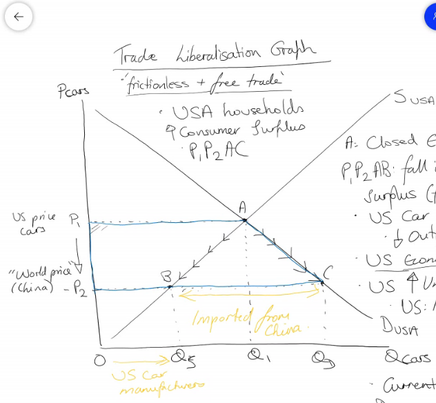
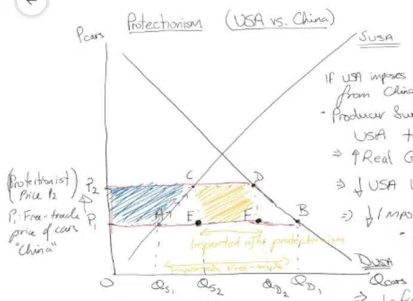
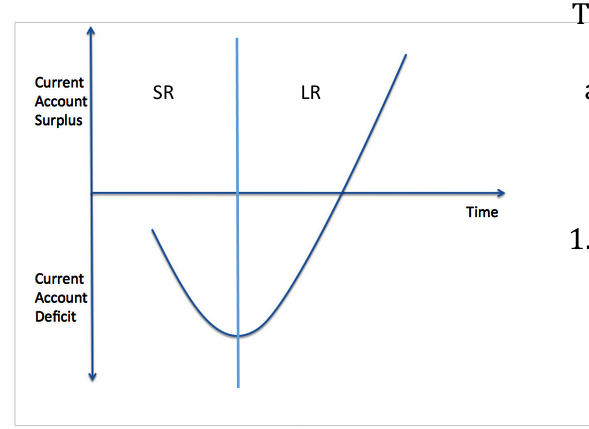
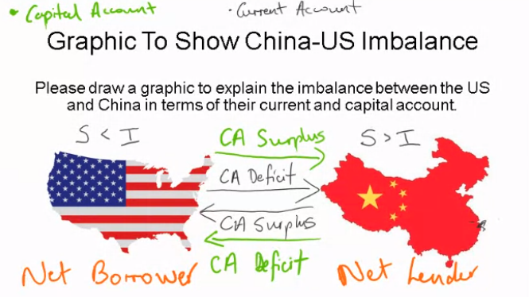
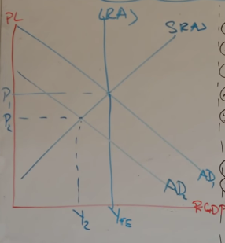
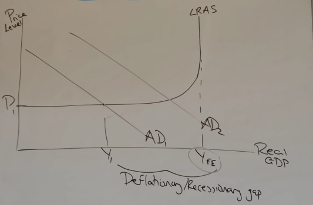
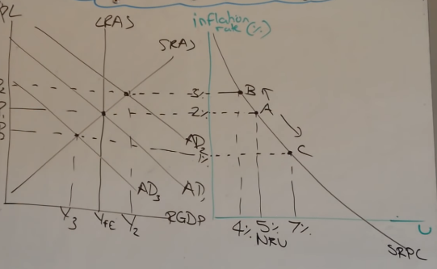
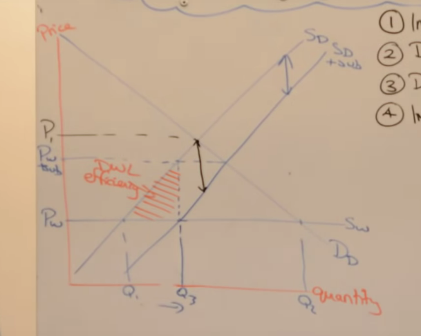

**International division of labour** a whole country specialises to create a specific and limited range

- Zambia - copper
- congo - cobalt
- UK - finance
- bangledesh - textiles
- UK - healthcare
- Brazil - Coffee
- Saudi Arabia - Oil

**Primary product dependant** countries are where a country is dependant on a natural resources such as land/crops/ores etc

**Absaoloute advantage** is if a country is better at making two (or more) goods than another country

- occurs wen a country can produce a product using fewer factors of production than another nation

**Comperative advantage** even if one country is better than making two goods than another country, they can both still benefit from trade if they speccilise in what they are comparatively best at (have the lowest opportunity cost in)


```
| x | Mobile phones | Televisions |
| UK | 100          | 50          |
| US | 50           | 20          |
-----------------------------------
| World | 150       | 70          | 
```

Eg to make one more mobile phone in the UK you sacrifce 0.5 TVs

For US onne more mobile phone will sacrifice 0.4 TVs

As the US has lower opportunity cost to make TVS, the US should make TVs and the UK phones

---

### Limitations of the comparitve advantage theory

- Assumes equal negotaiting power between both nations
- "monopsony power" + Primary product dependancy
- Transportation costs do not exist
- Factor immobility - occupational immobility  - labour/capital - lack skilled areas (theory assumes learning new occupation is instant)
- Assumes no barriers to trades, however they're are trading blocks and tarrifs
- Assumes constant returns to scale
- Assumes perfect knoledge, which there is not in the real world
- The rates of inflation are ignored
- doesnt take into account non-price competitiveness 
- does take into account exchange rates
- R&D investments are ignored

Brazil is the 9th largest economy in the world and they did it with **protectionism**, they refused to export goods when they we're growing, which encoureged western companies to build infrastrcture, companies and plantations in brazil in order to get the produce, which grew their economy.

**vertical restraint** is when a supplier helps you and then you are restrained, eg if coca-cola, gives a news agent a fridge with huge coca-cola logo on it and say they are not allowed to sell pepsi

---

### Specialisation

Advantages:
- Increase productivity and efficiency
- Possible improvementin current account
- Government spending can be directed into specific areas
- Exploit economies of scale

Disadvantage:
- Over reliant on one good/sercice
- risk of structural unemployment if the output of the sector fails
- specialisation could be in a good/service that is bottom of the value chain (Primary product dependancy)

---

### Reasons why overall global trade has risen:

- Greater amounts of free trade agreements
- barriers to trade have fallen
- containerisation (mass shipping)
- Increase in trading blocks
- diplomacy

---

**Depreciated currency** is when the value of the currency falls because of the market mechanism

**A devalued currency** is when the currency's value is artificially lowered to make their exports more competitive.

China has been accused of devaluing their currency.

---

### Determinates of Global trade patterns

- The rise of emerging/developing markets
- Changes in comparitive advantage
- Growth of trading blocs/trade agreements 
- change in the relative exchange rate

It is not enough to talk abbout interest rates controlling spending in A2, you *must* refer to base rate and commerical rates.

You must also acknowledge that the base rate is for the UK, and does not apply/effect global trade as much

---

### Terms of trade

`Terms of trade = (index of average export prices / index of average import prices ) * 100`

**Improvement of terms of trade** same amount of exports able to buy more imports

**Deteriation of terms of trade** same amount of exports able to buy less imports

Example:


**Determinants of Terms of Trade**

- Relative rates of inflation. Inflation makes your currency less valuable -> exports are worth less -> worse ToT
- changes in exchange rate
- Prices of specific goods or services. If you need natural resources (Commodities) to make your goods or services more cost to make. worsens ToT.
- Costs of production (Productivity, Wages, Taxes)

**Does an improvement in the ToT for a country increase standards of living**
- NO - inflation increases will decrease purchasing power. Real income goes down
- MAYBE - depends on Price elasticity of demand for imports/exports **PEDnx**
- NO - inequality, benefits are not evenly distributed
- YES - You can get more imports for the amount of exports

---

### Economic integration

Stages of economic graph:
1) Free trade Area
- Freedom of movment for goods and services only (Trade liberalisation graph)
2) Custom unions
- Border checks on common external tariff (**CET**)
- One group of countries act as one to get more negotiating power
- Requires *every single* participant to agree on a trade agreement
3) Common market
- Freedom of movment between labour and captial
4) monetary union
- Singular currency
- Common monetary policy
- European central bank

---

### Trading Blocs

Examples:
- EU (Europian union )
- NAFTA (North american free trade agreement)
- CIAS (Central American Integration System)
- AU (African union)
- AL (African leauge)
- PIF (Pacific Islands Forum)

Pros:
- Trade creation. Lower internal barriers to trade will move trade frm outside the trading bloc to inside.
- Job creation. Widening of the export market can potentially lead to more employment opportunities
- Access to goods and services. House holds can have greater access to a variety of goods and services at lower prices (allocative efficientcy) (or for macro: greater standard of living) real income increase
- Economies of scale. Larget market, more opportunity to lower costs and prices

Cons:
- Trade diversion. If you are not the best producer, trades will be done elsewhere. producer surplus loss in liberalisation graph
- Reduction in benefits and comparitive advantage. makes specialisation outside of the trading bloc worth less, less efficient
- Retaliation of external tariffs. eg, US and china
- Increasing regulations and red tape. Costs that are dervived from conforming with laws that dont help you. Reduces competitiveness and reduces frictionless trade.

---

### Globalisation  

**Globalisation** is the process in which national economies have become increasingly integrated and inter-dependant.

Causes:
- Trade liberalisation
- Trading Blocs
- Growth of MNCs (multinational coorperations)
- Technological advancement
- Mobilitiy of labour and capitals

Pros:
- Lower Prices because of international competition
- Benefits of trade, trading blocs, WTO
- Greater employment
- Benefits from large economies of scale
- Free movement of labour and capital
- Technological transfer and innovation

Cons:
- Growing inequality
- Higher structural unemployment
- Environmental costs -> lack of sustainability
- Trade imbalances
- Greater risk of external shocks
- Less cultural diversion

---

### Fixed exchange rate

To support a fixed exchange rate, the government or ceneral bank require to hold large amounts of currency reserves


Governments will buy or sell the currency, to increase/decrease the amount of the currency, *artificailly* changing the value of the currency.

---

### Exchange rate changes impact

**Appreciation**

Cons:
- lower growth - potential currency account deficiet
- higher unemployment in exporting industries
- higher unemployment in domestic industries

Pros:
- lower inflation -> Demand push and cost pull
- Cheaper imports -> better living standards
- Potential efficiency gains for domestric producers

**Depreciation**

Pros:
- Increase in employment in exporting industries
- Employment in domestic industries generally 

Cons:
- Higher inflation -> Demand pull and cost push

---

#### Governemnt intervention in foreign exchange markets 

Governments may wish to:
- Decrease exchange rate to increase employment
- Increase exchange rate to fight inflation
- Maintain a fixed exchange rate
- Stabilise a floating exchange rate
- impove a currency account deficit

---

### Purchasing power parity and exchange rates

The exchange rate should reflect the purchasing power of two countries. 

Eg at an exchange rate of £1:$1.60, £1000 should be able to buy £1600 worth of stuff

The **Real exchange rate** takes into account changes in costs and prices. It is a reflection of PPP.

The **Big max index** shows purchasing power through the prices of a big mac around the world

---

### Fixed vs floating exchange rates

**Floating**

Pros:
- Reduced need for currency reserves
- Freedom for domestric monetary policy
- Useful instrument for macroeconomic adjustment
- Partial automatic correction for a trade deficit
- Reduced risk of currency speculation

Cons:
- Volatility
- Self-corrrection of trade deficits unlikely

**Fixed**

Pros:
- lower exchange rate uncertainty
- some flexibility permitted
- Reductions in the cost of trade
- Discipline on domestric producers

Cons:
- Interest rate effects
- Large level of foriegn currency reserves needed
- Speculative attacks if exchange rate set too high or too low

---

### Marshall Lerner condition and the J Curve effect

The marshall-lerner condition states that a currency depreciation will only correct a current account deficit if PEDx + PEDm > 1

If the Price elasticty of demand for exports + Price elasticity of demand for imports is greater than 1.

**PED and Total revenue**:
- Elastic - Price increase, TR increase
- Elastic - Price decrease, TR increase

- Inelastic - Price increase, TR increase
- Inelastic - Price decrease, TR decrease

---

### Economic integration and trading blocs

**Economic integration** is the process whereby countires coordinate to reduce trade barriers and to harmonise monetary and fiscal policy

**Trading bloc** is a group of countries that join together and agree to increase trade between themselves

**Bilateral/multilateral trade agreement** is an agreement to reducew tarriffs and quotas between 2/multiple countries

**Types of trading bloc**:
1) Preferential trading area
- Reduce barriers to trade for specific goods or services 
- Eg europe and carabbean for specific agricultural goods and manufactured goods
2) Free trade Area (FTA)
- eliminate all trade barriers between themselves
- negotiate by themselves outside of the bloc
- NAFTA is best example
3) Customs union
- Same as FTA, but not allowed to make independant deals with outsiders, must be approved by all
4) Common market
- Customs union + common policies, like regulations
- free movment of labour and capital
5) Economic and monetary union
- All states adopt the same currency
- Same central bank
- Same monetary policy
6) Full economic integration
- Full integration
- One govening body
- Same policies
- Eg UK

---

### The EU Features

- Tariff/Quota free trade between member rotations
- Common policies, agriculture, fishing, competition, regional, envionmental
- Co-ordination of economic policy
- Common external trade barriers (tarriffs/quotas) on imports from non-member countries
- Free movement of labour and capital
- 17/27 members adopting the Euro


**Maastricht Criteria** - anyone who plans on joining the Eurozone must aligns its economy with existing member states given that there will be common monetary policy
- No more than 1.5 percentage points above 3 best performing memebers (lowest inflation)
- Deficit no more than 3% of GDP and debt no more than 60% of GDP (**Growth and stability pact**)
- Long term interest rates no more than 3 percentage points above 3 best performing members (lowest inflation)
- fix currency to euro for two years prior to becoming a member

Many countries break these rules, both big economies and little ones. They're are not very enforcable.

Why impose the maastricht criteria?
- Political union (prevent world wars)
- Similar / stable interest rates, prevents hot money etc
- collective responsibility for all memeber states. Eg Germany is responsible for Greece


Pros: 
- Free trade
- Increased Foriegn direct investment
- Huge market size
- Conditions to the EU can be quite small as a % of GDP
- Free movement of labour and capital

Cons:
- Forced to follow EU laws and regulations
- Cost of contributions to EU budget
- Trade benefits could accrue from Free trade agreements instead, including with nations outside the EU
- High levels of immigrations

---

### Trade creation and diversion

**Trade creation** is the movement from a high cost domestic producer to a low cost producer inside the customs union 

Trade diversion is the movement from a low cost foreign producer to a high cost producer within the customs union

---

### Monetary union

Pros:
- Non-fluctuating exchange rate
- lower costs from currency convertion
- Increaed business confidence
- Currency more stable against speculation
- Prices between countries easier to compare

Cons:
- Loss of monetary policy autonomy
- No potential for countries to alter their exchange rates
- Cost of currency convertion is very high
- Lack of a fiscal union

---

### World trade organisation

- Internation organisation that regulates world trade
- 164 member states

According to the WTO, ideal trade would be:
1) Non-discriminatory
2) free from barriers
3) Predictable
4) Promoting fair competition
5) Beneficial for developing countries through special provisions

Functions/Roles of WTO:
- Set/enforce rules on international trade
- Resolve trade disputes
- Provide a forum for negotiating trade liberalisation
- To monitor further trade liberalisation
- To increase transparency of the decision making process
- To help developing countries fully benefit from global trade 
- cooperate with other major economic instructions

---

### East Africa Moving towards monetary union

- Five east african countries aim of forming a single currency area by 2024
- Kenya, Uganda, Tanzabua, Burundi and Rwanda
- Trade creation but also diverses trade from internal/external
- reduce currency conversion costs for firms (including time costs)
- Promotes equality across currencies across EAC
- lack of infrastructure, baks, wifi etc. No competition, so one currency removes costs from bad banks
- governments dont want to hold currencies of unstable institution
- more control means less fraud, eg instead of charging a correct exchange rate of 1.75, individuals might charge 1.8
- easier to coordinate 5 countries than 27 in the eu

---

### Impact of monetary union membership

Advantages:

- Price transparency (bridges information gap)
- Removal of transaction costs
- Stable exchange rates
- Economic management

Disadvantages:
- Loss of monetary policy independance
- Moral hazard and economic mismanagement
- Lack of automatic adjustment of exchange rate
- Fiscal constraints of Maastricht Criteria will limit the ability for countries to spend their way out of recesion

--- 

### Who is to blame from Eurozone crisis

- Greece’s falsification of financial records/fiscal policies – made all other eurozone countries “collectively responsible” – they have no choice but to bailout Greece.  They broke the Stability and Growth Pact before they even joined (3% and 60% respectively)

- The EU/IMF emergency funds were mainly used to pay back interest and debt (loan repayments) – notice that Germany supported Greece to get this bailout, why? Because German banks were to be the biggest benefactors of the repayments!  Greece’s public sector workers didn’t get paid – firefighters went around homes with collection tins to give them some pay

- "Borrowing your way out of recession” was banned for Greece – caused political turmoil (new govt that hated austerity). Different from the UK’s coordinated borrowing from BoE to fund furlough (e.g.). We own both institutions and are trusted by foreign governments for them to hold onto debt (engage with FDI) – international interest rates UK are very low (<1%) (bond rate). Greece’s 30+%

---


### Black wednesday 1992

- Pound plummeted
- Early 90s Thatcher introduces big Austerity
- Fredrick Hayek econ adviser
- Late 80s massive Boom
- -> Massive inflation (20%)
- -> Increase interest rates (15%)
- --> Hot money
- --> Instability of exchange rates
- --> demand for sterling rises due to outsiders buying it in order to save
- ---> appreciated the value of sterling
- -> increase in MPS
- -> Availbility of credit (M4)

---

### Protectionism

- Donald Trump imposed 25% tariffs on $60bn of Chinese imports
- -> Stocks fell due to lack of confidence
- Free market economics argues against protectionism, against **Mercantilism** (for trade liberilsation)

Forms of protectionism:
- **Tariffs** - A tax on imports
- **Quotas** - limits imposed on the quaitiy of a good that can be imported
- -> eg, Common fisheries policy, only allowed to fish a certain amount
- **Embargoes** - total government bans on certain goods or on goods from certain economies
- **Subsidies** - grants to domestic firms who may either sell domestically or on the internation market
- **Foreign exchange controls** - Limitng the amount of foreign money domestic companies can buy
- **Import licensing** - limited the amount of licenses given to firms to import

---

### Trade liberalisation graph

- Producer surplus is the difference between the actual price and the lowest price a producer would be willing to accept for a good
- consumer surplus is the excess of the price over and above the equalibrium price

- Frictionless and free trade



- P1P2AB: fall in producer surplus (free-trade)
- -> US car manufactures have a fall in output (lack of incentive)
- -> US economic growth decreases
- -> US unemployment increases
- -> US imported deflationary pressures
- -> Current account deficit of USA worsens
- -> higher imports of cars

- USA households have an increase in consumer surplus of P1P2AC
- -> Real incomes increase
- -> Allocative efficiency increases
- -> Standard of living increases
- -> ABC is the net welfare gain 

---

### Protectionism / Tariff diagram



If USA imposes tariff on cheap car imports from china (P1 + Tariff) = P2

Pros:
- Producer surplus car manufacturers in USA to *rise* by P1 P2 A C
- Rise in real GDP in USA
- -> Economic growth increase *in america*
- Trade creation
- Fall in USA unemployment
- Fall in imports (Qd1-Qs1, to Qd2-Qs2)
- -> Imrpovement in USA current account

Cons:
- Inflationary pressures if sustained, demand pull inflation
- Consumer surplus (USA) will fall by P1 p2 B D 
- -> Price rises to P2, Real incomes for US households fall
- Lower allocative efficiency  (Q1 -> Q2)
- Standard of living decreases
- Increase in government tariff/tax revenue from imports (CDEF)
- -> Fund "G" into car exporting firms (export subsidies)
- --> Price competitive on international markets
- -> Funding exchange rate devaluations of dollar (theroretical, the dont do this)
- --> buy-up foreign currencies, weaken the dollar (exports, proce competitive) (Increase foreign reserves)

Two Welfare losses:
- A C E
- -> Due to the price rising from p1 to p2
- --> Real incomes fallen, demand decreases for other goods and services

- B D F
- -> Previously enjoying the utility from Qd1 cars demanded and supplied
- -> less Utility as less cars available from QD1 to Qd 2


---

### Consequences of rise in protectionism

Consequence: 
- Higher rates of inflation: Real incomes fall as the value of money falls -> Increased domestic trade 
- Less efficient domestic industry: Protectionism stops imports (or deters them) meaning they have to buy from inefficient firms which will have higher prices and thus less utility gained -> Doesnt matter that in some areas they were inefficient they are still the 9th biggest economy
- Reducing global growth rates : Trade diversion reduceses competition and thus decreases the need to innovate or expand -> Trade diversion is good for the Brazilian government as less money is leaving the economy and thus they can take more tax 
- Beggar thy negibour policies (trade wars): Protectionism leads to tradewars, eg China vs US  -> Even though there may be trade wars some countries which are export lead are still required to trade even if it isnt in their favour, or they China could find new markets (trade aversion)

---

### The rise of hidden protectionism

Hidden forms of protectionism: 
- tax breaks
- financing from state owned banks
- investment incentive programmes
- -> Annual investment allowance for UK firms and first year allowances on green technologies or on R&D. *Anything you spent on this got 100% deduction*

---

### Rationale for protectionism

- Infant industry argument: Temporary protection to infant industry is needed in order for these firms to mature and become competitive on the international market **BRAZIL**
- Protecting Employment: Protecting industries from foregin competition can maintain high levels of employment
- Government Revenue: A tariff is a tax on imports so gernerates revenue for the government
- Prevent Dumping: A situation whereby an economy exports its products at a price below its domestic price or below its actual cost of production to flood a market

---

### Tariff V Quota: Which is best?

- KAA : how Tarifs are good
- Ev : how tarifs are not good

- KAA : how quotas are good
- Ev: How quotas are bad

Impacts:
- Quota = Consistency on inport numbers, good for politicians to guarantee domestic market protection
- Quota = prevents tradegy of the commons, eg stops over fishing
- Tariff = *disincentivies* harvesting due to tax, higher costs, and thus harder to make profits. If it is still profitable they will overfish
- Tariff = Revenue gained can be used to subsidies domestic firms


---

### Protectionsim 25 marker

**Free trade creates many losers as well as winners, particularly in manufacturing. Thus, there is a strong case for protectionism in more economically developed countries**

To what extent do you agree with this argument for protectionism?

- Enforcing labour protections and standards. -> innefficient labour
- protection of domestic jobs -> innefficent labour
- more independance, less suseptible to overseas politcal termoil, eg your not effected by oil prices during wars in the middle east if you produce oil yourself. Eval: England might not be able to produce oil from the north sea as cheaply as it can be mined in the middle east 

---

### Question 1: Last year, the US imposed three rounds of tariffs on more than $250bn worth of Chinese goods. The duties of up to 25% cover a wide range of industrial and consumer items - from handbags to railway equipment. Evaluate the impact of these tariffs on the US economy. 

KAA Trade diversion, could encourage china to trade with other countries especially when exporting cars, eg Japan and vietnam.
Ev Revenue gained from tarrifs can be used to subsidies domestic firms,  eg subsidises US car manufacturing so they are not reliant on chinese imports

### Question 2: Since opening up to the global economy in 1978, China has averaged nearly double-digit growth rates. Manufacturing now accounts for roughly 40% of total output. Using the concept of comparative advantage, explain how the world economy has gained from China’s involvement in international trade. 

KAA - how it would be a benefit, more competiton, lower prices, more consumer benefit assuming domestic companies pass this on
Ev  - Cannot garuntee the quality of working conditons for foreign works, plus it lowers domestic employment

### Question 3: Following the Eurozone crisis, there were threats from Greece that they would leave the euro. Evaluate the economic benefit of such a country exiting a monetary union. 

KAA Greece falsified their statistic to get into the monetary union and thus should not have been in it, it would stop them from being a burden on the monetary fund, reduces moral hazard, 
Ev : Greece leaving may cause a lack of confidence in the leadership of the eu as they we're allowed to benefit from them and then leave, monitary union would look hypocritical as other countries violate growth/staiblity pacts before

KAA : Greece would have monetary controll and thus benefit as they can control monetary polcicies, this has worked before for countries such as the UK in  the financial crash
Ev : Even when they we're independant pre 2002 they were doing terribly, they did not meet the EU requirements. 


## International Competitiveness 

### 2018 Global competitiveness index (measured from 0-100)

1) US 85.6
2) Singaore 83.5
3) Germany 82.8
4) Switzerland 82.6
5) Japan 82.5
6) Netherlands 82.4
7) Hong Kong 82.3

**Competitiveness** refers to the ability of a country to sell its exports on the internatonal market

Competitiveness encourages FDI

### Measures (Determinants) of competitiveness

- Relative unit labour costs (cost per unit of output) - if lowered allows firms to lower their prices and be more competitve
- Relative rates of inflation (and exchange rates) - weak currency means exports are cheaper allowing you to be more competitive (China accused of artificially lowering their own value to do be more competitive)
- Labour productivity - The more you can produce per unit of labour means you can sell it cheaper, thus more competitive
- Infrastructure - Good infrastrucutre allows for cheaper transport costs -> lower costs in general -> thus lower prices and more competitive
- Technology - Better tech leads to more efficient production -> less costs -> lower prices -> more competitive
- Education - Better education can lead to more innovative tech and ideas -> lower costs -> lower prices -> more competitive
- Tax rates - Less tax on companies -> less costs -> lower prices -> more competitive. Eg Ireland has very low corperation taxfor this reason

**Unit labour costs** Measure the average cost of labour per unit of output and are calculated as the ratio of total labour costs to real output

### The consequences of Competitiveness

Problems of being uncompetitive:
- Worsening of net exports
- -> Leads to worsening of the Current account and Balance of payments
- -> Less AD in economy and foriegn investors could loose confidence in you leading to less FDI.

- other countries more cost efficient in production 
- -> production firms move out of host country to cheaper countries within trading bloc (no quotas/tariffs) 
- -> e.g. car manufacturing moving to mexico from USA. Loss of jobs and revenue within America

Benefits of being competitive:
- Your exports will be bought as they cannot be purchased from other countries for cheaper
- -> Leading to more government revenue from taxation
- -> Greater market share for firms, leads to more sales, more revenue. Less costs as they can utilise economies of scale more.

- Multi national companies will want to set up in your country
- -> eg when google set up in ireland
- -> More investment in your economy and economic developments, more employment etc

### Pillars of global compeititve index

Enabiling environment component
1) Institutions
2) Infrastructure
3) ICT adoption
4) macroeconomic stability
Human captial component
5) Health
6) Skills

### "How can the UK become the most competitive nation"

- The UK could move to a fixed exchange rate and then devalue it's own currency
- -> This would make the pound worth less and make domestic firms more internationally competitive
- However the WTO would likely deem this as anti competitive and fine you or other countries could impose tariffs or engage in tit for tat policies  

- Reduce corporation tax

### Role of WTO

- Establish the rules of global trade
- Settle disputes between members
- Reviews trade policies of memebers
- Offers technical assistance to developing countries

Now that we have left the EU we have a "no deal scenario" - The default WTO rules. **NOT** an Australian type deal, which has mini trade deals with eu

### WTO v Tradig Blocs

How might the formation of trading blocks conflict with the roles and aims of the WTO?
- External tariffs
- Discriminate against developing economies

#### Any agreement amongst member counties requires consensus from all. As such little progress has been made. Do you think that there are alternative systems to this?

- Move to a majority vote - Countries might collude
- Weighted votes?  with weighted seats, this will render small countries useless
- risk of retaliation from country that votes against 

#### What rights should the WTO have in terms of punishment for member countries that do not abide by the rules?

- Higher tariffs
- Temporary bans / embargoes
- Fines

### Exchange rates

SPICED - Strong pound, imports cheap, exports dear
WIPDEC - weak pound, imports dead, exports cheap

Year 2010 £1 = $1.44
Year 2011 £1 = $1.62 | Appreciation | import prices cheaper (demand for imports increase, **expected** current account worsens), exports dearer (exports less, worsens AD, worsens **expected** current account) | 

Flaoting exchangte rate - the value of a curfrency is determiend by free market forces

Managed exchange rate - the value of a currency can float freely within a range, but the government or central bank intervenes when the value falls outsid of this range

Fixed exchange rate - the value of a currency is fixed at a specific amount to another country. Any movement from this rate and government / central bank intervene

### Determinants of an exchange rate

- Relative rate of interest
- ->The hiher the exchange rate of a foriegn country the likely hotmoney flows will leave the domestic economies 
- Relative rate of infltion
- -> Effects the competitiveness of goods sold abroad - relative higher inflation rates, make domestic goods more uncompetitve
- Foreign Direct investment
- -> Coun tries exploiting their current account surpluses, by engaging in FDI to domestic economies
- Speculation of currency
- -> "Hot sellign" - drive up value of domestic ER  if positive "bullish" speculation about future rises, eg bitcoin as at 20/11/2020
- Domestic & Global income levels
- -> Entrance import ability for domestic economies as they increase their incomes and demand hgiher standards or living 


#### With the various demands of member countries, do you think that there are merits of having a global framework to international trade?

- Could stop first world countries abusing less powerful ones
- encourage or give grants to diversify production to stop Primary product dependancies

### Economic impact of fall in value of the pound sterling on the UK econ

1. Economic Growth
- Depreciation -> exports cheaper -> more competitive internationally -> rise in exports -> Increase in AD -> increase GDP 
2. Inflation
- cost push inflation if we are dependant on import materials
3. Current Account Deficit
- Exports are cheaper -> more competitive -> more sold -> improve current account defecit
4. Unemployment
- Firms cannot afford to pay for all of the workers due to higher costs -> lay off employees -> increase unemployment
5. Potential impact on interest rates
- interest rates will rise in order to counter inflationary pressures
6. Foreign Direct Investment
- if you have a weaker currency, investing becomes cheaper and thus is more appealing 

### How does the ER fluctuate to counter changing economic cycles?

boom -> high inflation -> exports uncompetitive (prices are high) -> imports are more competitive -> higher imports -> need foriegn currency to buy their imports, we sell sterling (dumping) to pay for it, increasing supply -> depreciation in the pound


### Economic impact of Exchange Rates 

(for the second paragraphs (sir's notes) this is when the ER has appreciated)
(for first paragraphs (mine) is when the ER has decreased)

Current Account - A worsening in the exchange rate makes your exports cheaper and thus more competitive, enabling you to sell more on the itnernational market, increasing your net exports and causing an improvement in the current account. In addition imports will become more expensive, encouraging buying from domestic firms. 

Expect CA worsen as improts cheaper and exports dearer. Therefore CA deficit UK worse
-> Depends on PEDNX - in the SR exports tied to 12 month contracts, foreign buyer pay higher amounts. CA may strengthn - inelastic PEDNX

Economic growth - a worsening in the exchange rate leads to more expensive imports, which encourages buying from domestic firms, which keeps money circulating within a country, utilizing the multiplier effect to increase consumption, investment and consequently increasing AD and economic growth. However this means consumer will be restircted in terms of variety, quality and price as they cannot/inhibited when buying from foriegn countries.

ER strengthns, value imports rise, therefore AD fall. Thereby harming Economic growth verall. (reduction in demand for UK firms)
-> Imports can come from manufacturing firms, who face cheaper raw materials. Reduce Costs of production (SRAS right) - enchance economic growth - Dutch Disease

Employment - a worsening in the exchange rate will drive up prices of imported commodities and thus will raise costs of production, if a business cannot handle this they may seek to cust costs my laying off workers which will increase unemployment. However as they are more competitive they may end up selling more, which could increase revenue and suggest they have the ability not only to support their current workforce but also hire more in response to the increase demand, decreasing unemployment

ER rises, exports expensiv abroad, demand based upon exporting firms fall - derived demand, maufacturing firms redundencies- rising unemployment 
-> However, Dutch Disease, if manufacturing firms rise in demand due to lower costs of import raw materials (oil commodities), then employment rise (sold to UK households)

Inflation - a worsening in the exchange rate will mean imports will become more expensive leading to higher costs, firms pricing them onto consumers and thus an increase in cost-push inflation

LR - Demand-pull defaltionary pressures as AD fall. Stockpiles around the economy when ER strengthens
-> SR - expect import prices falling (importing deflation) - oil prices plummeted around the world 2017 - deflation is EU countries. Cost-push deflationary pressures

Foreign Debt - a worsening in the exchange will increase the competitiveness on exports and thus the revenue generated from foriegn sources, the government will tax the increased profit from the firms and could put tariffs on certain key goods in order to generate more revenue. This revenue can then be used to repay foriegn debt. However in order for a tariff to generate significant money it must be on an inelastic good such as foodstuffs which in it's regressive nature, will effect poorer households who spend more relativley on such products. 

Foreign debt example: £1 - £1 (parity) oew $5m a mont to US. Monthly bill UK of £5m. UK ER strengthens to £1 = $2. $5m foreign debt become cheaper in the UK as UK govt pays £2.5m per month. So ER strengthening causes a fall in value of foreign debt payments
-> Also make domestic debts held by forigners to be devalued (US debt held in the UK). The overall impact depends upon effective exchange rate between two countries and their relative debt weightings held between both. Hence why China likes to keep it's ER devalued - increase the value of its Fooreign Debt abroad.

---

Compared to slide 85, this does is the opposite type of question. Starts witrh ER and ends up with the effect on macro indicators. 
UK ER stronger relative to the world's currencies (effective exchange rate) - weighted trade of currency fluctuations compared to the UK, Strengthens against US by 20% but falls against Euroby 10% - if USA and Eurozone (19) represents the World then UK ER has risen on average by 5%, however, the effective exchange rate reflects the weight of the trading relationship also. So if Eurozone = 40% of UK trade and US is 60% (world), then new EER = (+20% *.6) + (-10% * .4) = +12%


### Britain's trade deficit as worrying as its budget deficit - The Guardian, January 2013

"In the past, a 25% depreciation in sterling, of the sort seen in the first 18 months of the finanacial crisis, would have been sufficient to boost exports, limit imports and turn the trade figures around. Not this time. The current account deficit in 2012 was higher than it was in 2007"

What economic logic could you provide to explain this?

### Jcurve

The J-Curve is the diagrammatic representation of the Marshall-Lerner Condition



In the short run, the price elasticity of demand for net exports (imports and exports) tends to be *inelastic*

This is due to the consumers taking time to change spending patterns and firms being locked into trade contracts (approx 6 months)

In the long run, the price elasticity of demand for net exports is more *elastic* and this means that the current account will improve

### Marshal learner conition

Conditions:
1) If the domestic ER depreciates over time, and
2) The PEDnx is elastic (PEDnx > 1) (price elasticity of demand for net exports PEDnx)
If the two conditions are met the current account of the domestic economy will improve


The Marshall–Lerner condition is satisfied if the absolute sum of a country's export and import demand elasticities is greater than one. If it is satisfied, then if a country begins with a zero trade deficit then when the country's currency depreciates, its balance of trade will improve


### Comparing and contrasting exchange rate systems:

- Fixed exchange rate has certainty of currency, increases chance of FDI. Less volatile to speculative movements (btc). Hot money flow volatility reduced - guarantee levels of liquidity/credit in your economy. Manage inflation. Depends on the volatility of world's currencies. Saudi Arabia, Qatar - Fixed ER: garunteed flows of oil sales
- Floating better: less need for currency reserves. More flexibility in responding to currenct account changes. Freedom to set interest rates

### Purchasing Power Parity (PPP)

PPP is effectivley the **real exchange rate** (ER is often over or under valued)

UK vs Germany basket of goods £1000: €1200
if the floating ER is £1: €1.20 (nominal ER) then we have a PPP. If converted, same value.

if german basket rose to €1400 (inflation, wages rising, passing on price increases).
Now the UK cannot buy the exact same goods and services in germany - the pound would be undervalued. No longer have PPP
- This encourages buying in the UK from germany -> dumping of the euro and demand sterling. The exchange rate appreciates

### Big mac index

Big max index comapares the prices of big macs in different countries in order to see if they are under or over valued

Over valued currencies increase imports

### Balance of payments

- The balance of payments is a record of *all* economic transactions with the rest of the world
- BOP *should* be zero in theory. If capital account is negative -> capital account will be positive
- BOP = current account + capital account (financi9al account) + Errors and ommissions

- GDP + Net income from abroad = GNP

BOP Current account:
- Trade in services 
- Net income (wages, profit, interest)
- Net transfers (government and remittance payments)
- Trade of goods (also called trade in visibles)

BOP Capital account:
- FDI
- Intellectual property
- Debt forgiveness
- Hot money flows
- Foreign reserves

Trade deficit is when the value of imports > value of exports

**Trade decicit != current account deficit**

current account deficit is when the (outgoings of the BoP, net income, net transfer) is > the credits


### BoP: Credit or Debit?

- BT purchase of £12m of new wires from a chinese company - debit (current account)
- Polish migrants send £55m worth of wages back to their home country. - debit (current account)
- Tata steel (india company) takeover a steel company in the the north of england for £2bn - credit (capital account)
- Stemcor (UK owned) make £335m worth of profit in th US and sends it back home - credit (current account)
- The UK contributes £11bn to the EU budget - debit (current account)


# Additonal SMG notes during live marking

Looking for:
- 2 points on why wage disparity exists, eg discrimination, skils, age, link to MRP
- Economics knoledge. 
- key words, inelastic, elastic. Make sure the graph reflects this
- good or bad is irrelevent, you are explaining why they exist or not
- take your answers back to the question in every paragraph

Mark scheme key points:
- no application = level 1
- level 3 = "accurate knoledge", level 4 = "precise knoledge"
- level 3 = knoledge and then application added at the end vs level 4 = "evidence integrated" merge the application into ur answer with good examples 

Ioans essay (23/25):
- immediate focused example (get there as soon as possible)
- reference points on the axis when talking about the graph
- economic termnology. MRP
- Dont bounce between different examples, pick one and do it well (started with neurology and never mentioned it again). This doesnt mean you cant compare two different examples (eg footballers *vs* retail workers)
- still focused in the evaluation
- graphs are economic terms and ideas
- reasons and evidence to why economic ideas are true. maternaty leave = lower MRP
- 5th paragraph is an additional facit but connected to above
- could have weighed up the arguments

Nathans essay (18/25):
- Starts of focused
- graph could have saved writing, but not needed
- a solution to the problem off KAA is **not** the same as a counter. Talk about LR/SR or the significance/impact, etc
- not as much specific econ terminology
- eval didnt counter the original kaa, so it's not good

Hasans essay (24/25):
- **immediate** focused examples
- economic terms
- evidence to support economic claimed based on example
- focus example in eval, good specific counter with economic arguments
- refering to specific points on the graph
- advanced graph
- showing on the graph how it relates to focused example
- doesnt need as many chains of reasoning because the graph boosts it
- counter example with unions + another graph
- 5th paragraph was a summary which didnt add anything. could have talked about the power of trade union (argued the evaluation of one point)

5th paragraph notes:
- which argument matters more
- argue the significance of points
- **an effective 5th paragraph *ranks***

### Notes on feedback. essay 1, infrastructure [KAA 3 Eval 2+] (10/16 + 6/9  = 16/25)

- focused example of broadband was good
- go more in depth, you could talk about how this helps education -> supply side increase
- could use the example of zoom calls over pandemic
- eval was not A2 enough, generic AS response

Overall:
- use more A2 theory/concepts

### Notes on feedback. Essay 2, protectionism [KAA 3 Eval 2+/3-] (10/16 + 6/9 = 16/25)

- first KAA focused. used graph effectivley
- analysis was a bit simple, instead of "employ more", talk about increase in domestic demand -> real gdp growth -> falling unemployment
- mentioned higher prices in eval but did not talking explicitly about a decrease in consumer demand
- take it back to the question 
- second KAA generic AS, use A2 concepts, mentioned customs unions which cause trade creation too -> brazil gain power within trading bloc -> ability to set prices -> Protect PPD
- evidence for eval, eg when tit-for-tat you could mention US vs China
- 5th para made it stronger  

Overall:
- KAA had alot of AS and not much A2


### Comparative judgement - Perfect Paragraph

Evaluate the impact on the UK economy of a fall in the value of the pound sterling from £1:$1.43 in April 2018 to £1:$1.30 in October 2018

- A 9% decrease in the value of the pound can make exports more competitive, 
- Eval: marshal lerner condition, assumes PED etc

- Global dumping if the sterling due to lack of confidence, this wont increase exports since they have no confidence
- Eval:  this can attract US investment as it will be cheaper

### Global Trade Imbalance

A global trade imbalance describes a situation in which there are economies that run large current account surplus and countries that run large current account deficits

Current account surplus nations = China and Germany

Current account deficit nations =  UK and US

### What are Global Trade imbalances?

Trade is a zero-sum game (if someone wins, another one loses)

A currenct account surplus (X-m) to boost employment because it is indicative of higher domestic demand

if you have a current account surplus, it means a foreign entity is funding your economic growth and employment

- high export -> increased employment in export sector
- lower import spending -> increased domestic purchase -> helps employment
- Greater share is exported then domestically consumed (rebalancing the economy)
- Accumulation of foreign assets

**surplus leads to higher inflation**

Current account surplus can be bad, if it is caused by less imports due to a recession

when a country buys UK gov bonds, we dont call it them investing in us, we call them a "net lender"
- China is a net lender to alot of the world and thus this allows them to abuse people and get away with it

Because China/Germany is production based, the maximise scale of economies, to make themselves more competitive
- due to germanys power in the eu they set policies to keep their exports more competitive, 

Trump said "we are funding china and the world"
- The US has a trade deficit with China, eg they are importing more from them, they support them

Current account surplus -> lower domestic demand + increased unemployment
- if the companies are to busy being competitive and exporting, the citizens have to import
- you move from consumption led to export led and thus focus more on exports

deflation leads a self-fulfilling phrophecy of deflation
- you think its going to fall -> firms arent selling so they lower their prices to sell the stockpike -> you think you're right -> you save more -> repeat

As you become export led
- you hurt domestinc employment
- you become dependant on foreign investment

15/01/21 China recorded the largest trade surplus in its history

### BOP Accounting Identitity

Current Account (X-M) = Savings - Investment

- Chinese savings rate = 46% of GDP (all currencies, not just yuan)
- -> Domestic saving is 20% (chinese households/firms MPS)
- -> Current account surplus funds the last 26% of the saving (foreign savings)

**The current account surplus / foreign savings are then used to buy other countries bonds, a good investment, makes other countries dependant on China, and dumps their currency making it less valuable -> more competitive**

Savings > Investment: high savings -> consumption low -> likely current account surplus -> likely not invested domestically, moved abroad. country becomes a net lender

Savings < Investment: High level of consumption implies that savings is low -> current account deficit. in order to fund additional investment, a country borrows money from foreign countries (net borrrower)



Export v Imports | Current Account position | Capital account position | Savings V investment | Net Lender or Borrower | Explanation
X > M            |                  surplus | deficit                  | S > I | Net Lender | as monies recieved net of imports payments, are used to find FDI abroad 

### SMG live marking 2 notes

Show how the price mechanism allocates houses

Student C (3/15):
- No eval, so limited

Student A (15/15):
- Graph was right
- focused on houses
- good economics

Student B (10/15):
- made the same point twice
- there was a contradiction

Section B
- people misunderstood the figure


Feedback:

I appreciated that you worked through lower mark questions, however I feel that people wanted to work through them so that they can draw parrallels to their own work, when the errors are as simple as not writing an eval paragraph or not mentioning what the question has asked you too, it feels slightly redundant as I (hope) think it does not apply to us.

In addition, when we focused exclusivley on AS work, I feel as if time would have been better spent analysing A2 work. As someone whos current transient problem is not fully understanding the bridge between levels 2, 3 and 4, I feel that it would be more beneficiall analysing work which falls withing this range.


### Causes of Global Trade Imbalances

Exchange Rates & Government intervention
- Devaluation of ER, competitive exports, imports decreasing -> persistent surplus of CA -> net lender -> reduced reliance on foreign countries

Wages Rates
- lower wage rates boost international competitiveness -> lower disposable incomes -> less ability to save -> MPC rises -> increases savings gap
- higher wage rates -> higher mps -> more domestic savings -> reduces net borrrowings from abroad

Savings / Consumption as share of GDP
- if government sell all their bonds abroad it means domestic firms can invest less

Globalisation & Outsourcing
- increases contestability
- trading blocs 

### What can Explain the Eurozone imbalance?

Dutch Disease - between regions with different effects of currency fluctutations on 19 eurozone countries, export-based, eg Germany/Holland do well with more price competitive exports yet have the economic power to negotiate import prices that accounts for dearer import raw materials.
- One country gets hurt by ER, another is harmed
- Germany and Holland can negate higher import prices using their monopsony power to determine the prices
- This abuse from first world countries creates cyclical, generational poverty in developing countries

Trading Bloc - internal trade impact amongst monetaty union
- creates trade diversion
- no currency translation costs imposed
- encourages intra-eurozone trade

### Is the existence of global trade imbalances a problem for the global economy?

Trade imbalance = country spends - country produces

Surplus = income from production > spending (seek investment led growth)

Deficit = spending > producing (debt-fuelled growth)

Both sets of countries rely on each other

is it a problem? NO:
- Capital glows amongst countries -> allows for excess savings countries to invest in developing markets. These markets have a lack of financial market competition
- Current account deficits that are modest and economies investing capital inflows that boost producictivity growth - crease sustainable inbalances for the world

is it a problem? YES:
- Current Account deficits are larger -> fuels inequality in the future
- Lead to destabilising capital flows - over leveraged countries with huge debts find it difficult to use large scale capital flows to fund productive uses for them. Used to fuell asset bubbles, and excessive household borrowing - imbalance in the economy

### Consequences of Global Trade Imbalance

Trade deficit countires accumulate largr amounts of debt which can lead to financial crisis and defaluting on loans
- 9% of government spending is debt *interest*

Trade surplus countries are entirely reliant on debt driven consumption of the defiict countries.

Zero-sum games of trade imbalances create toxic relaitonships

Leads to protectionsim, tit-for-tat war

### Policies to correct Global trade imbalances

Expenditure reducing policies
- control demand and limit spending

Expenditure switching policies
- shifting spending away from imports and towards domestic market

Supply side policies
- boosting the competiitveness of domestic industry (linked to global competitiveness index)

Overall deficit countries need better net exports, and higher net savings, in order to not be dependant on foreign counties

Surplus countries need higher net imports and higher net investment domestically. ie generate more consumption


Structural changes fix this (supply side policies):
- Germany/Japan (Expenditure lags behind output) - reverse decline in wages relative to national income to boost consumption, domestic invesment, reducing net savings.
- China reduce excess savings - reduce subsidies to corporate sector, improve unemployment programs to stop household precautionary savings (traditional action in china)
- US/UK/Eurozone trade deficit imbalances - shift relative prices (real exchange rates) to reduce domestic costs and prices, wage cuts, govt pursue fiscal austerity. Higher unemploymnt -> MPS rise -> raise price of imports relative to domestic output - reduces savings gap
- -> Deflation causes value of debt to rise - increasing debt burdens whilst income falls

### Why does the UK run a current account deficit

Net importers - net brrowers -dependant upon foreign capital to fund savings gap issues

UK Exports 2020 - machinaery/comp (15.6%), Vehicles (10.8%), Gems/Metals (9%)

UK Imports 2020 - Gems/Metals (12.8%), Machinery/comp (12.3%), vehicles (10.7%)

### Determinants of the Current account (Trade balance)

1) Exchange rates
2) Relative rate of inflation
3) Economic growth (High imports)
4) Level of investment
5) Cost of production (Productivity, Wage Rates, Corporate Tax)
6) Quality of Exports
- Due to quality, the exports are likely to have inelastic demand
- -> Appreciated Exchange rate should benefit us
- Due to quality, the exports are likely to be income elastic
- -> makes our goods a luxury, when the world is an a boom/recovery we are likely to do well
7) Global Market Conditions (Pandemic/Brexit)

### Consequences of a current Accoutn deficit

1) Drag on AD -> reduce econ growth - Keynesian stimulous to boost AD (if we have space capacity)
2) Increase unemployment 
- issue of hysteresis
3) Deflationary pressure on AD, but cost-push inflationary pressure if import prices rising and **Dependance**
4) Increase volatility to world-wide shocks
5) Dependance on goods/services from other countries and economic changes

### Problems of a currenct account deficit

- Economic growth falls
- Inflation may rise
- High unemployment
- High levels of debt
- Exchange rate depreciates
- -> more imports mean you dump your currency and it depreciates

S&P Global Ratings, Moody's and Fitch Group control bond market rates for international borrowing.

The lower your international bond rate, the more likely you are to get credit. 

UK has a productivity problem and thus any current account surplus will be used to boost multiplier and and make unsustainable growth. so it doesnt matter

- median wage is $47k in london (high productivity)
- median wage is $42k in northan ireland (lack of productivity)

OECD (Organisation for Economic Co-operation and Development) and WTO are ineffective as they require unanimous consent to take action. 

The goal of the OECD is to promoite the economic welfare of its *memebers*. They're are only 37 nations in their, and most of them are rich nations (europe, US, Japan, Korea, New Zeland)

### How can you make international trade work for all?

FDI China in Africa:
- Where has china invested (top 5)?
- 1) Nigeria
- 2) South Africa
- 3) Zambia
- 4) Ethiopia
- 5) Egypt
- Alot of these are port towns/cities
- Africa is mineral rich, China need these resources
- Large supply of labour
- -> used cheaply to continue manufacturing production of chinese goods
- -> Africa dont see the profits but do see the employment
- Chinese money builds African infrstructure
- Chinese get gold cobalt and gold from congo, copper from zambia, oil from Angola
- China build military base operations in Africa to counter wester countries (political gains as well as economic)
- lack of education in Africa, lower productivity
- lack of health in Africa, lower life experience

### Costs and benefits of FDI

Benefits:
- Provides employment 
- Improves level of human capitals (training)
- Imrpoves infrastructure

Costs:
- Migrant workers
- Workers may be exploited 
- Reparations of profits
- Foreign inputs into production

# Additional Econplusdal notes on macro ------------------------------------------------------------------------------------------------------------------------------

---

### Classical AS/AD model

Assumptions:
- SRAS determined by costs of productions
- LRAS determined by quantity/quality of Factors of Production
- SR equilibrium is when AD = SRAS
- LR equilibrium is when AD = LRAS
- SR where wages are fixed
- LR where wages are variable



---

### Keynesian AS/AD model



---

### Short run Philips Curve

- when unemployment is low, inflation increases
- more people working = more people getitng paid = more demand = more inflation
- built on classical assumptions



**stagflation** is when unemployment is high and so is inflation

- the philips curve was adapted to show this by classical economists

---

### Multiplier and Accelerator

The **Multiplier** is the process by which any changes in the components of AD will lead to an even greater change in national output
- Multiplier = 1/(1-MPC) = 1/MPW

The **Accelerator** are the changes in investment that can be directly linked to changes in the *rate* of GDP growth
- firms more willing to invest due to confidence and profits (if GDP growth positive)

### Balance of Payments

Current account:
- Trade in goods
- Trade in Services
= Trade balance

- Investment income
- Transfers 
= Income balance

Capital account:
- Very small part of it
- Debt forgiveness is recorded
- Inheritance taxes overseas
- Death duties overseas
- Transfer of financial assets by migrants
- Sales of tangible assets
- Sales of intangible assets

Financial account:
- Portfolio investment transactions, the buying and selling of financial assets, eg shares, bonds, etc (in and out of the country)
- Foreign direct investment, eg, foriegn companies setting up in the UK.
- Reserve changes, Eg gold.

Current acount deficits cannot be sustained in  the long run, the US balances this by having a positive Finnancial accout, Eg china (large current account surplus) buy US assets, shares, etc.

### Consequences of a current account defecit

1) 
- Lowers AD 
- net exports (x-m) is decreasing

2)
- Debt burdens
- other countries/investors loose confidence in your country to repay
- Currency crisis -> leads to economic crisis

3)
- Falling exchange rate
- if there is more supply of sterling, the value of the pound would decrease
- could automatically correct a current account deficit *but* could lead to stagflation

### Current account defecit - Expenditure reducing and expenditure switching policies

**Expenditure reducing** - Reduce AD -> reduce incomes -> reduce marginal propensity to import :
KAA:
- Contractionary monetary policy 
- Contractionary fiscal policy
Eval:
- Conflict of objectives
- Consumer and Business confidence so high that AD doesnt fall
- Output gap, if econ is in full employment, there is no garuntee that incomes are going to decrease
- Marginal propensity to import, if its not high already it wont work

KAA:
- Protectionism
- -> Tarrifs, Quotas, Embargo, Domestic subsidy
- -> Non-Tariff Barriers
Eval:
- Retaliation can make CA deficit worse, other countries might implement tariffs on your exports
- WTO rules, regulation/fines
- Inflationary, tarifs and quotas increase price of improts
- Higher prices for consumers
- Loss of efficiency

KAA:
- Weaker exchange rate
- -> weaken the exchange rate, imports more costly, less imports
- -> Increase money supply, weakens exchange rate, QE
- -> sell domestic currency reserves, giving away more of your own currency increases supply
Eval:
- Inflation
- Retaliation and currency wars

KAA:
- Supply side polciies to boost internation competitiveness
- -> governmet spending on infrastructure/education/subsidies
- -> lower taxes
- -> privitsation/deregulation
- -> reducing power of trade unions
- -> reduce welfare benefits
Eval:
- Time
- Costs
- No garuntee of success

### Cause and consequence of current accout surplus

Causes:
- Demand side
- -> High incomes abroad
- -> Low incomes at home
- -> Weak exchange rate (WIDEC)
- Supply side
- -> Low relative inflation
- -> low Unit labour costs
- --> High productivity
- --> Weak Trade unions
- --> Low minimum wages
- -> Strong investment 
- -> Gains in comparitive advantage
- -> New resource discoveries

Consequences:
- Increasing net exports, increases AD, increased Growth, Decreased unemployment, Increased inflation
- Appreciation of the exchange rate
- Financial account deficit
- Can harm international relations
- Sign of an unbalanced economy?

### Law of comparative advantage

**Absolute advantage** - Occurs when a country can produce a product using fewer factors of production that another nation

**Comparative advantage** - States that a country should *specialise* in the goods or services it can produce at *the lowest opportunity cost*, and then trade with another country

### Criticisms of the law of comparative advantage

Limitations of the model:
- Perfect knowledge
- Not transports costs -> distorts CA
- No economies of scale -> distorts CA
- Rates of inflation ignored -> distorts CA
- No import controls -> distorts CA
- Non-price competitiveness ignored
- Exchange rate movements ignored -> distorts CA
- R&D investment ignored

### Gains from free trade

- Increased efficiency and increased allocation of world resources, Comparative advantage
- Access to goods that wouldnt be produced domestically
- Lower prices from Competition, economies of scale due to larger market, Technological transfers
- Greater consumer choice
- Economic growth

### Gains for protectionism

- Infant industry argument
- -> Economies of scale
- -> Short term protectionism
- Protect against "dumping" 
- -> Sale of a good below its cost of production, floods the market, ruins domestic industry
- Protect domestic employment
- Protect against "unfair" low cost labour abroad (china abuse)
- Protect product standards
- To raise gov revenue (tariff)
- To improve a current account deficit (increased econ growth)
- To avoid the risk of over-speicialisation

### Tariff

The effect of tariffs on:

- Price:
- -> Price increases from world price, to world price + tariff
- Domestic demand:
- -> Decreases as higher prices put people off
- Domestic supply:
- -> Increases as they become more compeitive
- Imports:
- -> fallen from Q1Q2 to Q3Q4, when world price intersects both S and D curves, to when world price + tarif intersects both S and D curves
- Domestic producer revenue:
- -> Increases as they sell more due to being more competive, Q*(worldPrice + tariff)
- Foriegn producer revenue:
- -> decreases significantly, less sales in another country and there is a tax taken
- Gov revenue
- -> gets tax rev from tariff
- Consumer surplus:
- -> Decreased as price increases
- Producer surplus:
- -> increases with artifically higher prices
- Dead weight welfare losses:
- -> two areas of DWL, consumer loss and world loss

### Tariff disadvantages

- Market distortion
- -> Increased price 
- -> less choice 
- -> lower consumer surplus
- -> Deadweight welfare loss
- Production inefficiencies
- -> discourages efficiency
- -> moral hazard
- Retaliation
- -> Other countries will oppose tariffs on you
- --> Hurts consumers even more
- --> Less rev from exports
- ---> worse current account
- Regressive
- -> consumers bare the burden
- -> Tariffs are often put on necessities which low income households spend most on

EVAl:
- It all depends on the elasticity of demand and supply

### Trade subsidy

A subsidy for domestic company which allows them to make cheaper goods and thus be more competitive
- The subsidy is not large enough to lower the price. Therfore no consumer loss of surplus
- No change in demand, but there is a change in domestic supply
- loss of allocative efficientcy, deadweight welfare loss



- protects infant industries
- less imports so harder to suffer from dumping
- improve domestic employment
- improve CA position since less imports

Effect on different areas:
- price = unchanged
- Domestic demand = unchanged 
- Domestic supply = increased
- Imports = decreased
- Domestic produced revenue = increased
- Foreign produced revenue = decreased
- Government cost = the difference between the two supply curves (the value of the subsidy) times quantity
- Dead weight welfare loss = increased

### International competitiveness

The ability of a nation to comepete successfully overseas and to sustain improvements in living standards and output

Types of competitiveness:
- Price competitiveness
- Non-price competitiveness
- Abiltiy to attract FDI

Measures of competitivness:
- ULC, unit labour costs (total labour costs/output)
- Global competitiveness index (GCI)
- Terms of trade, ratio of relative imports and exports

Factors that determine international competiveness (GCI):
- unit labour costs 
- Labour flexibility
- Labour skills
- Tax regimes
- Innovation
- Infrastructure
- Regulation
- Economic stability

### Policies to improve international competitiveness

Supply side policies
- Price competitiveness
- non-price competitiveness
- attracting FDI

1) Gov spending on infrastructure
2) Tax incentives (lower coorperation,income, and investment tax)
3) Deregulation
4) Government spending on education (improve skills)

Eval:
- Cost + opportunity cost
- No guarantee such policies will work
- Time lag
- Targeted?
- Relative concept

### Globalisation

Process in which national economies have become increasingly integrated and inter-dependant

Causes:
- Trade liberalisation
- Trading blocs
- Growth of MNCs
- Technological advancement
- Mobility of labour and capital

Pros:
- Lower prices -> more internatonal competitive
- Benefits of trade 
- Greater employment
- Benefits from large EoS
- Free movement of labour and capital
- Technological transfers and innovations

Cons:
- Growing Inequality
- Higher structural unemployment
- Environmental costs -> lack of sustainability
- Trade Imbalances
- Greater risk of external shocks
- Less cultural diveristy

### Fixed and floating exchange rates

To support a fixed exchange rate, the government or central bank required to hold large amounts of both domestic and foreign currency reserves

### Exchange rate changes impacts

Appreciation -> SPICED

1) Lower growth -> Potential currenct account deficit
2) Higher unemployment in exporting industries
3) Higher unemployment in domestic industries
4) Lower inflation -> DP and CP
5) cheaper imports -> increased livng standards
6) efficientcy gains for domestic produce

Depreciation -> WIDEC

1) increased employment in exporting industries
2) increased employment in domestic industries generally
3) higher inflation -> DP & CP

### Fixed vs Flating exchange rates

Floating:

Pro:
- less need for currency reserves
- freedom for domestic monetary policy
- useful instrument for macroeconomic adjustment
- Partial automatic correction for a trade deficit
- Reduced risk of currency speculation

Cons:
- volatility
- sel-correction of trade deficits unlikely

Fixed:

Pros:
- less exchange rate uncertanty
- Some flexibility permitted
- Reductions in the cost of trade (reduced hedging)
- Discipline on domestic producers

Cons:
- Interest rate effects...
- Large level of foreign currency reserves needed
- Speculative attacks if exchange rate set to high or to low

### Government intervention in Forex markets

Governments may wish to:
- decrease exchange rate to increase employment
- increase exchange rate to fight inflation
- Maintain a fixed exchange rate
- stabilise a floating exchange rate
- improve a currenct account deficit

How?:
- Buy or sell domestic currency using currency reserves
- Change interest rates (unlikely, high interest rates encourage hot money, increase demand for currency, increase ER)
- -> negative side effects on consumption etc.

### Economic Cycle Features and Causes

Boom:
- increase AD, increase confidence
- decreased unemployment
- increased investment
- increased demand pull inflation
- increased tax revenue gov

Slow down/recession:
- Decreased AD, decreased confidence
- increased unemployment
- de-stocking and price discounting

Recovery:
- increased house prices (consumer confidence to borrow mortgages shows recovery)
- increased investment
- increase consumption
- loose macro policy
- increased construction/manufacturing (sign that business have gained confidence to invest)
- increased growth and lower unemployment

### Costs and benefits of economic growth

Benefits:
- Rise in material standards of living 
- unemployment reduction
- Positive impact on gov finances
- Promotes investment -> accelerator

Costs:
- income inequality 
- -> Capital intensive growth
- -> industry dependent growth
- Higher rates of inflation
- Negative externalities
- -> pollution
- -> resource depletion
- -> resource degradation

Sustainable growth is SR and LR with low and stable inflation

### Cost and benefits of unemployment

Costs to the economy:
- Lost output
- Deterioration of government finances
- -> Higher spending on benefits
- -> lower tax revenue
- -> increase on areas which suffer from higher unemployment (crime rates / mental health etc)
- Hysteresis (permenant damage to labour, less skill, less labour force participation, companies going bust)
- Social costs
- Reduced trade in other countries, less confidence in domestic economy from a foreign perspective

Costs to the individual:
- Lost income
- Loss of status, self-worth -> leads to hysterisis, negative externalities (mental health costs etc)


Benefits:
- Firms benefit from greater choice
- Workers have time to search for the best job

Evaluation:
- Type of unemployment (cyclacle can be fixed, structural cant, frictional is short run can actually be good as it indicates seek for better job) - duration
- Severity - how big is the unemployment rate? Natural rate of unemployment is 4-6% in UK
- Level of unemployment benefits -> type of country

### Costs and benefits of inflation

Costs of inflation:
- reduction in purchaisng power
- Menu costs
- Shoe leather costs - the oppportunity cost of finding the best rate of return for different banks to combat inflation
- Fiscal drag 
- Reduced international competitiveness
- Anticipated inflation leads to more inflation 
- Uncertainty 
- Savers suffer

Benefits of low stable infation:
- workers -> demand higher wages (even if it is just to match inflation, it can boost confidence)
- increase in production as it allows firms to increase their prices when it rises
- lowers unemployment in recession
- Stable consumption (buy now, your puchasing power is decreasing)

Evaluation:
- Cause - cost push or demand pull? DP is healthy to certain extent (increase in AD) CP is bad -> stagflation
- Duration - is it going to be long term or short term? short term doesnt really matter
- Anticipated?
- Seventy - is it low or high? stable or volatile?

### Fiscal policy and borrowing

Budget Deficit: Where G > Tax revenue in a fiscal year

National Debt: The accumulation of budget deficits, The total stock of debt

