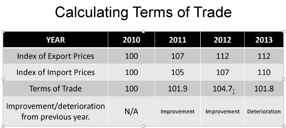
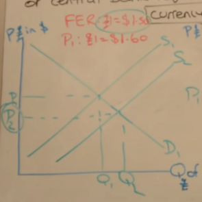

**International division of labour** a whole country specialises to create a specific and limited range

- Zambia - copper
- congo - cobalt
- UK - finance
- bangledesh - textiles
- UK - healthcare
- Brazil - Coffee
- Saudi Arabia - Oil

**Primary product dependant** countries are where a country is dependant on a natural resources such as land/crops/ores etc

**Absaoloute advantage** is if a country is better at making two (or more) goods than another country

- occurs wen a country can produce a product using fewer factors of production than another nation

**Comperative advantage** even if one country is better than making two goods than another country, they can both still benefit from trade if they speccilise in what they are comparatively best at (have the lowest opportunity cost in)


```
| x | Mobile phones | Televisions |
| UK | 100          | 50          |
| US | 50           | 20          |
-----------------------------------
| World | 150       | 70          | 
```

Eg to make one more mobile phone in the UK you sacrifce 0.5 TVs

For US onne more mobile phone will sacrifice 0.4 TVs

As the US has lower opportunity cost to make TVS, the US should make TVs and the UK phones

---

### Limitations of the comparitve advantage theory

- Assumes equal negotaiting power between both nations
- "monopsony power" + Primary product dependancy
- Transportation costs do not exist
- Factor immobility - occupational immobility  - labour/capital - lack skilled areas (theory assumes learning new occupation is instant)
- Assumes no barriers to trades, however they're are trading blocks and tarrifs
- Assumes constant returns to scale
- Assumes perfect knoledge, which there is not in the real world
- The rates of inflation are ignored
- doesnt take into account non-price competitiveness 
- does take into account exchange rates
- R&D investments are ignored

Brazil is the 9th largest economy in the world and they did it with **protectionism**, they refused to export goods when they we're growing, which encoureged western companies to build infrastrcture, companies and plantations in brazil in order to get the produce, which grew their economy.

**vertical restraint** is when a supplier helps you and then you are restrained, eg if coca-cola, gives a news agent a fridge with huge coca-cola logo on it and say they are not allowed to sell pepsi

---

### Specialisation

Advantages:
- Increase productivity and efficiency
- Possible improvementin current account
- Government spending can be directed into specific areas
- Exploit economies of scale

Disadvantage:
- Over reliant on one good/sercice
- risk of structural unemployment if the output of the sector fails
- specialisation could be in a good/service that is bottom of the value chain (Primary product dependancy)

---

### Reasons why overall global trade has risen:

- Greater amounts of free trade agreements
- barriers to trade have fallen
- containerisation (mass shipping)
- Increase in trading blocks
- diplomacy

---

**Depreciated currency** is when the value of the currency falls because of the market mechanism

**A devalued currency** is when the currency's value is artificially lowered to make their exports more competitive.

China has been accused of devaluing their currency.

---

### Determinates of Global trade patterns

- The rise of emerging/developing markets
- Changes in comparitive advantage
- Growth of trading blocs/trade agreements 
- change in the relative exchange rate

It is not enough to talk abbout interest rates controlling spending in A2, you *must* refer to base rate and commerical rates.

You must also acknowledge that the base rate is for the UK, and does not apply/effect global trade as much

---

### Terms of trade

`Terms of trade = (index of average export prices / index of average import prices ) * 100`

**Improvement of terms of trade** same amount of exports able to buy more imports

**Deteriation of terms of trade** same amount of exports able to buy less imports

Example:



**Determinants of Terms of Trade**

- Relative rates of inflation. Inflation makes your currency less valuable -> exports are worth less -> worse ToT
- changes in exchange rate
- Prices of specific goods or services. If you need natural resources (Commodities) to make your goods or services more cost to make. worsens ToT.
- Costs of production (Productivity, Wages, Taxes)

**Does an improvement in the ToT for a country increase standards of living**
- NO - inflation increases will decrease purchasing power. Real income goes down
- MAYBE - depends on Price elasticity of demand for imports/exports **PEDnx**
- NO - inequality, benefits are not evenly distributed
- YES - You can get more imports for the amount of exports

---

### Economic integration

Stages of economic graph:
1) Free trade Area
- Freedom of movment for goods and services only (Trade liberalisation graph)
2) Custom unions
- Border checks on common external tariff (**CET**)
- One group of countries act as one to get more negotiating power
- Requires *every single* participant to agree on a trade agreement
3) Common market
- Freedom of movment between labour and captial
4) monetary union
- Singular currency
- Common monetary policy
- European central bank

---

### Trading Blocs

Examples:
- EU (Europian union )
- NAFTA (North american free trade agreement)
- CIAS (Central American Integration System)
- AU (African union)
- AL (African leauge)
- PIF (Pacific Islands Forum)

Pros:
- Trade creation. Lower internal barriers to trade will move trade frm outside the trading bloc to inside.
- Job creation. Widening of the export market can potentially lead to more employment opportunities
- Access to goods and services. House holds can have greater access to a variety of goods and services at lower prices (allocative efficientcy) (or for macro: greater standard of living) real income increase
- Economies of scale. Larget market, more opportunity to lower costs and prices

Cons:
- Trade diversion. If you are not the best producer, trades will be done elsewhere. producer surplus loss in liberalisation graph
- Reduction in benefits and comparitive advantage. makes specialisation outside of the trading bloc worth less, less efficient
- Retaliation of external tariffs. eg, US and china
- Increasing regulations and red tape. Costs that are dervived from conforming with laws that dont help you. Reduces competitiveness and reduces frictionless trade.

---

### Globalisation  

**Globalisation** is the process in which national economies have become increasingly integrated and inter-dependant.

Causes:
- Trade liberalisation
- Trading Blocs
- Growth of MNCs (multinational coorperations)
- Technological advancement
- Mobilitiy of labour and capitals

Pros:
- Lower Prices because of international competition
- Benefits of trade, trading blocs, WTO
- Greater employment
- Benefits from large economies of scale
- Free movement of labour and capital
- Technological transfer and innovation

Cons:
- Growing inequality
- Higher structural unemployment
- Environmental costs -> lack of sustainability
- Trade imbalances
- Greater risk of external shocks
- Less cultural diversion

---

### Fixed exchange rate

To support a fixed exchange rate, the government or ceneral bank require to hold large amounts of currency reserves



Governments will buy or sell the currency, to increase/decrease the amount of the currency, *artificailly* changing the value of the currency.

---

### Exchange rate changes impact

**Appreciation**

Cons:
- lower growth - potential currency account deficiet
- higher unemployment in exporting industries
- higher unemployment in domestic industries

Pros:
- lower inflation -> Demand push and cost pull
- Cheaper imports -> better living standards
- Potential efficiency gains for domestric producers

**Depreciation**

Pros:
- Increase in employment in exporting industries
- Employment in domestic industries generally 

Cons:
- Higher inflation -> Demand pull and cost push

---

#### Governemnt intervention in foreign exchange markets 

Governments may wish to:
- Decrease exchange rate to increase employment
- Increase exchange rate to fight inflation
- Maintain a fixed exchange rate
- Stabilise a floating exchange rate
- impove a currency account deficit

---

### Purchasing power parity and exchange rates

The exchange rate should reflect the purchasing power of two countries. 

Eg at an exchange rate of £1:$1.60, £1000 should be able to buy £1600 worth of stuff

The **Real exchange rate** takes into account changes in costs and prices. It is a reflection of PPP.

The **Big max index** shows purchasing power through the prices of a big mac around the world

---

### Fixed vs floating exchange rates

**Floating**

Pros:
- Reduced need for currency reserves
- Freedom for domestric monetary policy
- Useful instrument for macroeconomic adjustment
- Partial automatic correction for a trade deficit
- Reduced risk of currency speculation

Cons:
- Volatility
- Self-corrrection of trade deficits unlikely

**Fixed**

Pros:
- lower exchange rate uncertainty
- some flexibility permitted
- Reductions in the cost of trade
- Discipline on domestric producers

Cons:
- Interest rate effects
- Large level of foriegn currency reserves needed
- Speculative attacks if exchange rate set too high or too low

---

### Marshall Lerner condition and the J Curve effect

The marshall-lerner condition states that a currency depreciation will only correct a current account deficit if PEDx + PEDm > 1

If the Price elasticty of demand for exports + Price elasticity of demand for imports is greater than 1.

**PED and Total revenue**:
- Elastic - Price increase, TR increase
- Elastic - Price decrease, TR increase

- Inelastic - Price increase, TR increase
- Inelastic - Price decrease, TR decrease

---

### Economic integration and trading blocs

**Economic integration** is the process whereby countires coordinate to reduce trade barriers and to harmonise monetary and fiscal policy

**Trading bloc** is a group of countries that join together and agree to increase trade between themselves

**Bilateral/multilateral trade agreement** is an agreement to reducew tarriffs and quotas between 2/multiple countries

**Types of trading bloc**:
1) Preferential trading area
- Reduce barriers to trade for specific goods or services 
- Eg europe and carabbean for specific agricultural goods and manufactured goods
2) Free trade Area (FTA)
- eliminate all trade barriers between themselves
- negotiate by themselves outside of the bloc
- NAFTA is best example
3) Customs union
- Same as FTA, but not allowed to make independant deals with outsiders, must be approved by all
4) Common market
- Customs union + common policies, like regulations
- free movment of labour and capital
5) Economic and monetary union
- All states adopt the same currency
- Same central bank
- Same monetary policy
6) Full economic integration
- Full integration
- One govening body
- Same policies
- Eg UK

---

### The EU Features

- Tariff/Quota free trade between member rotations
- Common policies, agriculture, fishing, competition, regional, envionmental
- Co-ordination of economic policy
- Common external trade barriers (tarriffs/quotas) on imports from non-member countries
- Free movement of labour and capital
- 17/28 members adopting the Euro

Pros: 
- Free trade
- Increased Foriegn direct investment
- Huge market size
- Conditions to the EU can be quite small as a % of GDP
- Free movement of labour and capital

Cons:
- Forced to follow EU laws and regulations
- Cost of contributions to EU budget
- Trade benefits could accrue from Free trade agreements instead, including with nations outside the EU
- High levels of immigrations

---

### Trade creation and diversion

**Trade creation** is the movement from a high cost domestic producer to a low cost producer inside the customs union 

Trade diversion is the movement from a low cost foreign producer to a high cost producer within the customs union

---

### Monetary union

Pros:
- Non-fluctuating exchange rate
- lower costs from currency convertion
- Increaed business confidence
- Currency more stable against speculation
- Prices between countries easier to compare

Cons:
- Loss of monetary policy autonomy
- No potential for countries to alter their exchange rates
- Cost of currency convertion is very high
- Lack of a fiscal union

---

### World trade organisation

- Internation organisation that regulates world trade
- 164 member states

According to the WTO, ideal trade would be:
1) Non-discriminatory
2) free from barriers
3) Predictable
4) Promoting fair competition
5) Beneficial for developing countries through special provisions

Functions/Roles of WTO:
- Set/enforce rules on international trade
- Resolve trade disputes
- Provide a forum for negotiating trade liberalisation
- To monitor further trade liberalisation
- To increase transparency of the decision making process
- To help developing countries fully benefit from global trade 
- cooperate with other major economic instructions