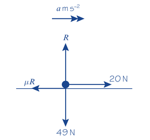

Friction is a force which opposes motion between two rough surfaces. It occurs when the two surfaces are moving relative to one another, or when there is a **tendancy** for them to move relative to one another

The limiting value of the friction depends on two things:
- The normal reaction R between the two surfaces in contact
- The roughness of the two surfaces in contact

Roughness can be measured using the **coefficient of friction**, which is represented by the letter $\mu$.

The maximum or limiting value of the friction between two surfaceas, $F_{MAX}$, is given by:

$F_{MAX} = \mu R$

Where $\mu$ is the coefficient of friction and R is the normal reaction between the two surfaces.

---

Example 8

A particle of mass 5kg is pulled along a rough horizontal surface by a horizontal force of magnitude 20N. The coefficient of friction between the particle and the floor is 0.2

Caluculate:

a) The magnitude of frictional force

b) The acceleration of the particle

A)

$R = 49N$ (from 5*g)

$F = \mu R = 0.2 \times 49 = 9.8N$

B)

$20 - \mu R = 5a$

$5a = 20 -9.8$

$= 10.2$

$a = 2.0ms^{-2}$ (2sf)