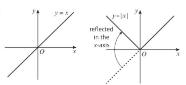

# Functions and graphs

A modulus function is in geeral, a functio of tge type

 $y = \left | f(x)  \right |$

$f(x) \geq 0, \left | f(x)  \right | = f(x)$

$f(x) \lt 0, \left | f(x)  \right | = -f(x)$

To sketch the graph of $y=\left | ax + b \right |$, sketch $y =ax + b$ then reflect the section of the graph below the x axis in the x axis

---
2A)
1)a)

$\left | \frac{3}{4} \right | = \frac{3}{4}$

6)a)

$\left | 3x -1 \right | = 5$