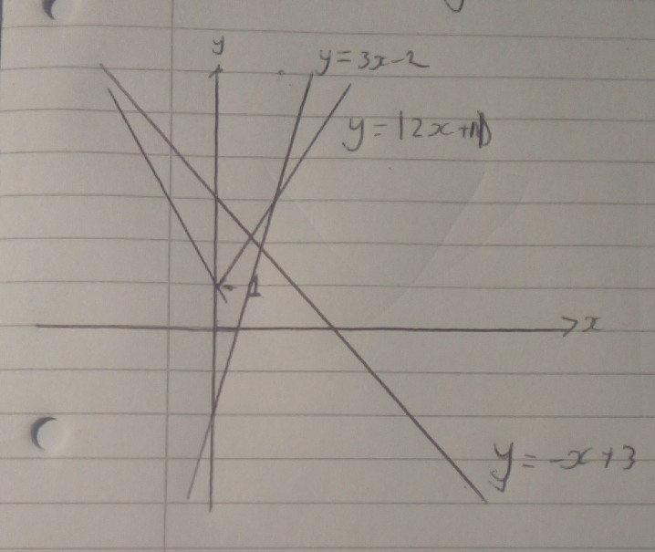
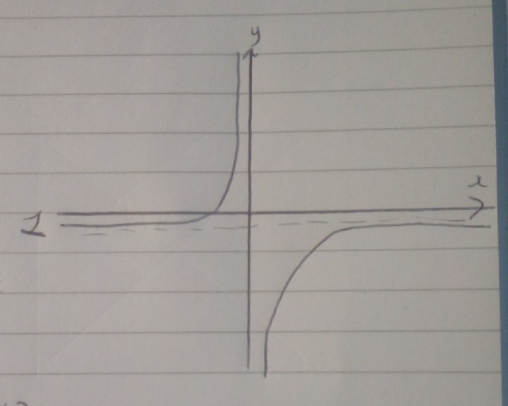
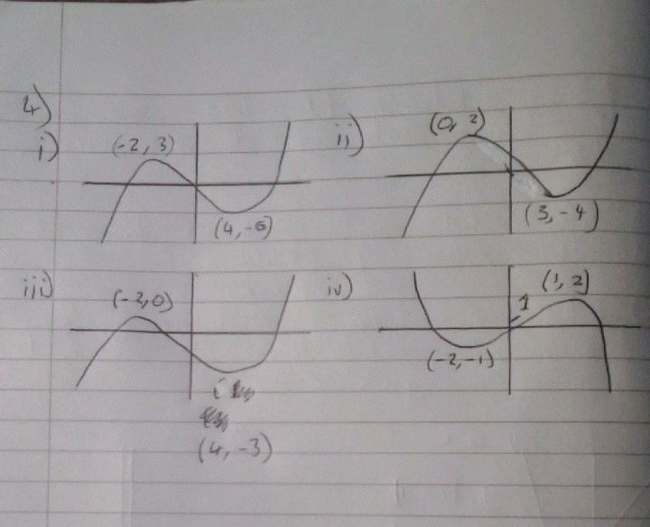

1)

$f(x) = e^x$

$g(x) = \sqrt{x}$

$h(x) = 2x + 1$

i) 

$fg(x) = e^{\sqrt{x}}$

domain is when $x \in \mathbb{R}$ and $x \geq 0$ 

range is $x \geq 1$

ii)

$gh(x) = \sqrt{2x+1}$

domain is when $x \in \mathbb{R}$ and $x \geq -0.5$

range is $x \geq 0$

iii) 

$hf(x) = 2e^x + 1$

domain is when $x \in \mathbb{R}$

range is $x > 0$

iv)

$f^{-1}(x) = ln (x)$

domain is when $x \in \mathbb{R}$

range is $x > 0$

v)

$h^{-1}(x) =\frac{x-1}{2}$

domain is when $x \in \mathbb{R}$

range is when $x \in \mathbb{R}$

2)

i) sketch the graph $y = |2x+1|$

ii)
a) $|2x + 1| = 3-x$

$2x + 1 = 3-x$

$3x = 2$

$x = \frac{2}{3}$

$y = \frac{7}{3}$

b) $|2x + 1| = 3x -2$

$2x + 1 = 3x -2$

$x = 3$

$y = 7$

3)
i) 

domain is when $x > 0$

range is $y < 1$ 

ii)

$f^{-1}(x) = \frac{-1}{x-1}$

iii)

domain is when $x \neq 1$

range is $\in \mathbb{R}$

iv)

v) The same except the first one has a asympote of y = 1, and the inverse has an asymptote of y = -1

4)

5)
i)

$|3x-2| \leq 4$

$3(4)-2 = 10$

$-(3(4)-2) = -10$

$x < -10$ or $x > 10$

ii)

