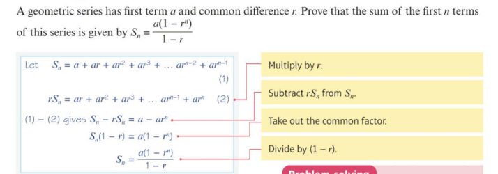

# 3.4

A **geometric series** is the sum of the terms of a geometric sequence. 3, 6, 12, 24,...is a geometric sequence. 3+6+12+24 is a geometric series

The sum of the first nth terms of a geometric series is given by the formulae:

$S_n = \frac{a(1-r^n)}{1-r}$, $r \neq 1$ 

or $S_n=\frac{a(r^n-1)}{r-1}$, $r \neq 1$

where a is the first term and r is the common ratio

