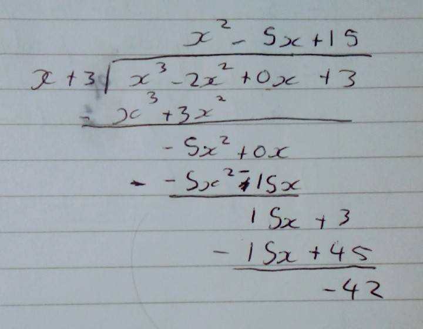

1) Expand $(3-x)^{-4}$ in ascending powers of x up to and including the term in $x^3$ stating the range for which the expansion is valid

$(1+x)^n = 1 + nx + \frac{n(n-1)}{2!}x^2 + \frac{n(n-1)(n-2)}{3!}x^3$

$(3-x)^{-4} = 3(1-\frac{x}{3})^{-4}$

$3[(1-\frac{x}{{3}})^{-4} = 1 + -4(\frac{x}{{3}}) + \frac{-4(-5)}{2!}(\frac{x}{{3}})^2 + \frac{-4(-5)(-6)}{3!}(\frac{x}{{3}})^3]$

$3[(1-\frac{x}{{3}})^{-4} = 1 - \frac{4}{3}x + \frac{10}{9}x^2 - \frac{20}{27}x^3]$

$(3-x)^{-4} = 3 = 4x + \frac{10}{3}x^2 - \frac{20}{9}x^3$

$|x| < 3$

2) Simplify $\frac{4x^2-1}{2x^2 +5x -3}$

$\frac{4x^2-1}{2x^2 +5x -3}$

$\frac{(2x+1)(2x-1)}{(2x-1)(x+3)}$

$\frac{(2x-1)}{(x-3)}$

3) Write as a single fraction in its simplest form $\frac{x}{x-3}-\frac{3x}{x^2-9}$

$\frac{x}{x-3}-\frac{3x}{x^2-9}$

$\frac{x(x^2-9)}{x-3(x^2-9)} - \frac{3x(x-3)}{x^2-9(x-3)}$

$\frac{x^3-9x}{x^3-3x^2-9x+27} - \frac{3x^2-9x}{x^3-3x^2-9x+27}$ 

$\frac{x^3-3x^2-18x}{x^3-3x^2-9x+27}$

(polynomial long div)

$\frac{(x-6)(x+3)(x+0)}{(x-3)(x^2-9)}$

4) Write $\frac{6}{9x^2-1}$ as a sum of two partial fractions

$\frac{6}{9x^2-1}$

$\frac{6}{9x^2-1} = \frac{A}{(3x-1)} + \frac{B}{(3x+1)}$

$6 = A(3x+1) + B(3x-1)$

sub x = $- \frac{1}{3}$

$6 = A(0) - 2B$

$B = -3$

sub x = $\frac{1}{3}$

$6 = A(2) + B(0)$

$A = 3$

$\frac{6}{9x^2-1} = \frac{3}{(3x-1)} + \frac{-3}{(3x+1)}$

5) Given that $\frac{x+15}{(x-1)(x+3)} \equiv \frac{A}{x-1} + \frac{B}{x+3}$ find values for A and B

$\frac{x+15}{(x-1)(x+3)} \equiv \frac{A}{x-1} + \frac{B}{x+3}$

$x+15 = A(x+3) + B(x-1)$

sub x = 1

$1 + 15 = 4A$

$A = 4$

sub x = -3

$-3 + 15 = -4B$

$B = -3$

6) Divide $\frac{x^2-3x-4}{x^2-25}$ by $\frac{x+1}{x-5}$

$\frac{x^2-3x-4}{x^2-25} \div \frac{x+1}{x-5}$

$\frac{x^2-3x-4}{x^2-25} \times \frac{x-5}{x+1}$

$\frac{(x-4)(x+1)}{(x+5)(x-5)} \times \frac{x-5}{x+1}$

$\frac{(x-4)1}{(x+5)1} \times \frac{1}{1}$

$\frac{(x-4)}{(x+5)}$

7) Divide $x^3 -2x^2 + 3$ by $x+3$

$(x^3 -2x^2 + 3) \div (x+3)$

$(x^3 -2x^2 + 3) \div (x+3) = x^2 -5x + 15 - \frac{42}{x+3}$

8) $\frac{1+x}{1-2x}$ is approximately equal to $1+ax+bx^2$. Find the values of a and b

$\frac{1+x}{1-2x} = 1+ax+bx^2$

$1+x = (1-2x)1+ax+bx^2$

$1+x = 1 + ax + bx^2 -2x -2ax^2 -2bx^3$

$0 =ax + bx^2 -3x -2ax^2 - 2bx^3$

9) i) Write $\frac{9}{(1-x)(1+2x)^2}$ as partial fractions
- ii) Using you answer to part (i), expand $\frac{9}{(1-x)(1+2x)^2}$ up to and including the term in x^2, stating the range of values for which your expansion is valid

i) $\frac{9}{(1-x)(1+2x)^2} = \frac{A}{1-x} + \frac{B}{1+2x} + \frac{C}{(1+2x)^2}$

$9 = A(1+2x)^2 + B(1-x)(1+2x) + C(1-x)$

sub x = 1

$9 = A(1+2(1))^2$

$9 = 9A$

$A = 1$

sub $x =-\frac{1}{2}$ 

$9 = \frac{3}{2}C$

$C = 6$

$9 = 1(1+2x)^2 + B(1-x)(1+2x) + 6(1-x)$

$9 = 1 + 2x +4x^2 +2x + B(1+2x-x-2x^2) + 6-6x$

$0 = 4x^2 -2Bx^2 + Bx -2x + B + 7$

$9 = x^2(-2B+4) + x(B-2) + (B+7)$

sub x = 0

$9 = B + 7$

$B = 2$

therefore

$\frac{9}{(1-x)(1+2x)^2} = \frac{1}{1-x} + \frac{2}{1+2x} + \frac{6}{(1+2x)^2}$

---

ii) 

$(a + x)^n = 1 + nx + \frac{n(n-1)}{2!}x^2$

$\frac{9}{(1-x)(1+2x)^2} = \frac{1}{1-x} + \frac{2}{1+2x} + \frac{6}{(1+2x)^2}$

$1[(1-x)^{-1} = 1 + -1(-x) + \frac{-1(-1-1)}{2!}(-x)^2] =1 + x + x^2$

$2[(1+2x)^{-1} = 1 + -1(2x) + \frac{-1(-1-1)}{2!}(2x)^2] = 2-4x+8x^2$

$6[(1+2x)^{-2} = 1 + -2(2x) + \frac{-2(-2-1)}{2!}(2x)^2] = 6 -24x +72x^2$

$(1+x+x^2) + (2-4x+8x^2) + (6-24x+72x^2)$

$81x^2 - 27x + 9$

$9x^2 - 3x + 1$

