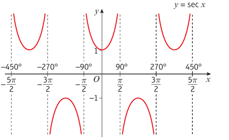
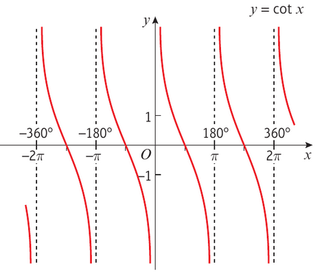

The graph of **y = sec x**, has 
- symmetry in the y axis
- period (repatition) of 360 degrees or 2pi radians
- has vertical asympototes at all the values of x for which cos x = 0

The **domain**  of y = sex c is where x != 90,270,450, ... or any odd multiple of 90

The **range** of y = sec x is y <= -1 or y >=1

---

The graph of y =cosec x, has
- period 360 degrees / 2pi rads
- vertical asymptotes at all the values of x for which sin x = 0

The **domain** is when x != 0, 180, 360,... or any multiple of 180

The **range** of y = cosec x is y <= -1 or y >= 1

---

The graph of y = cot x, has
- period of 180 degrees / pi rads
- vertical asymptotes at all the values of x for which tan x = 0

The **domain** of y = cot x is when x != 0, 180, 360,... or any mltiple of 180

The **range** of y = cot x is when y is a real number