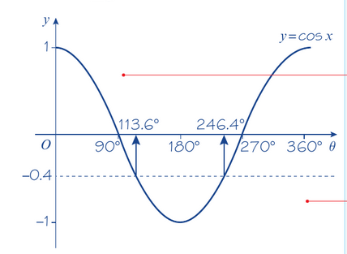

sec x = k and cosec x = k have no solutions for -1 < k < 1.

---

eg, solve the equation sec x = -2.5 in the interval 0 <= x <= 360

$\frac{1}{cosx} = -2.5$

$cos x = \frac{1}{-2.5} = -0.4$

therefore x = 113.6, 246.4