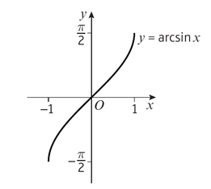
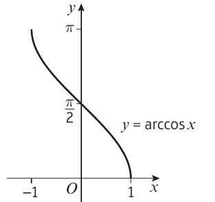
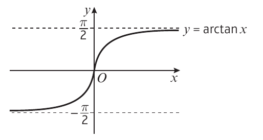

The inverse function of sin x is called arcsin x

The **domain** of y = arcsin x is -1 <= x <= 1

The **range** of y = arcsin x is $-\frac{\pi}{2} \leq arcsin x \leq \frac{\pi}{2}$ 

or -90 <= arcsin x <= 90 (degrees)

---

The inverse function of cos x is called arccos x

The **domain** of y = arccos x is =1 <= x <= 1

The **range** is 0 <= arccos x <= 180

---

The inverse function of tan x is called arctan x

The **domain** is when x is a real number

The **range** is -90 < arctan x < 90